# Informe ejecutivo - Decision Tree para Offer_Received

## 1. Mensaje clave

Este proyecto construye un árbol de decisión para predecir `Offer_Received` con foco explícito en `SI OFERTA (1)`. El entregable final está preparado para presentación y para reutilización operativa: deja un artefacto base, uno mejorado y un conjunto de gráficas que explican el comportamiento del modelo sin necesidad de abrir el notebook.

### Configuración final del modelo mejorado

- `criterion = gini`
- `max_depth = None`
- `min_samples_split = 2`
- `min_samples_leaf = 5`
- `ccp_alpha = 0.0001`
- `threshold óptimo = 0.32`

## 2. Archivos entregables

### Modelos serializados

- [Baseline](decision_tree_offer_received_base.pkl)
- [Mejorado](decision_tree_offer_received_improved.pkl)

### Gráficas del baseline

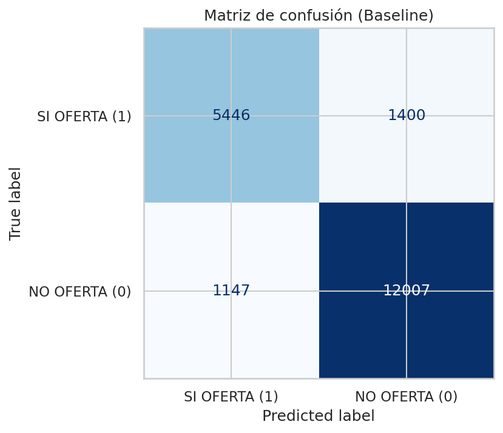

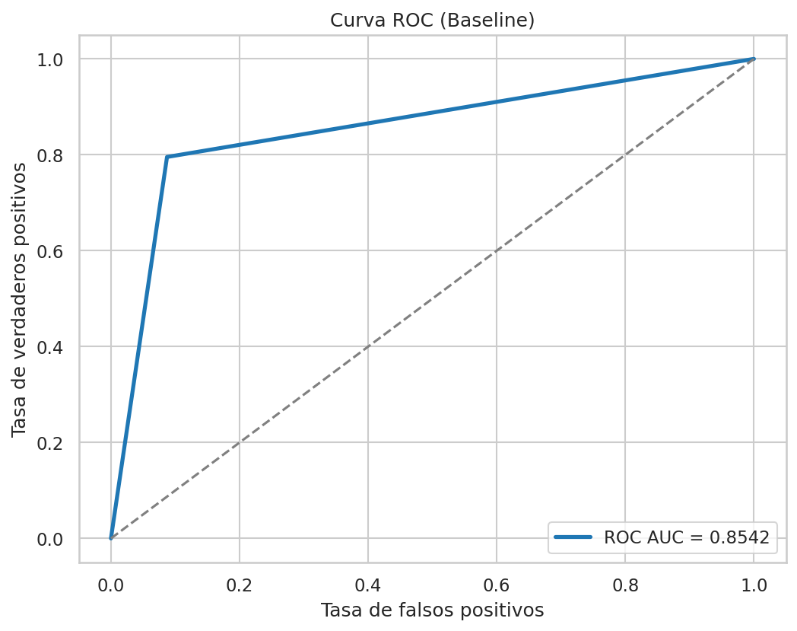

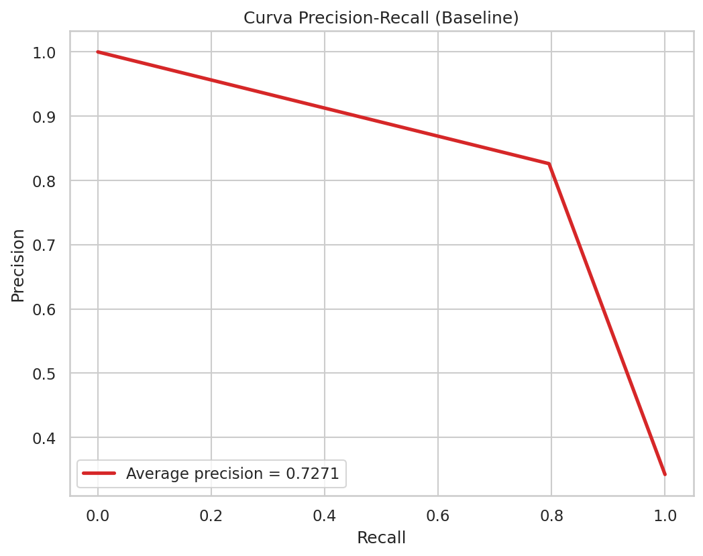

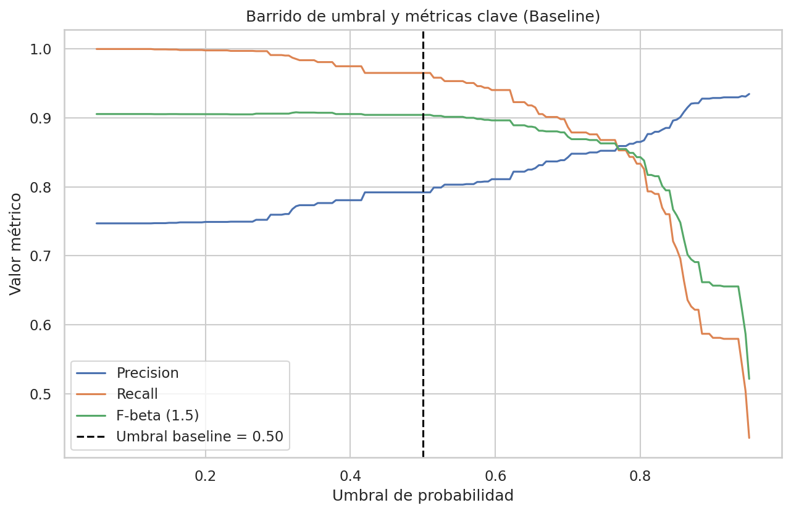

### Gráficas del modelo mejorado

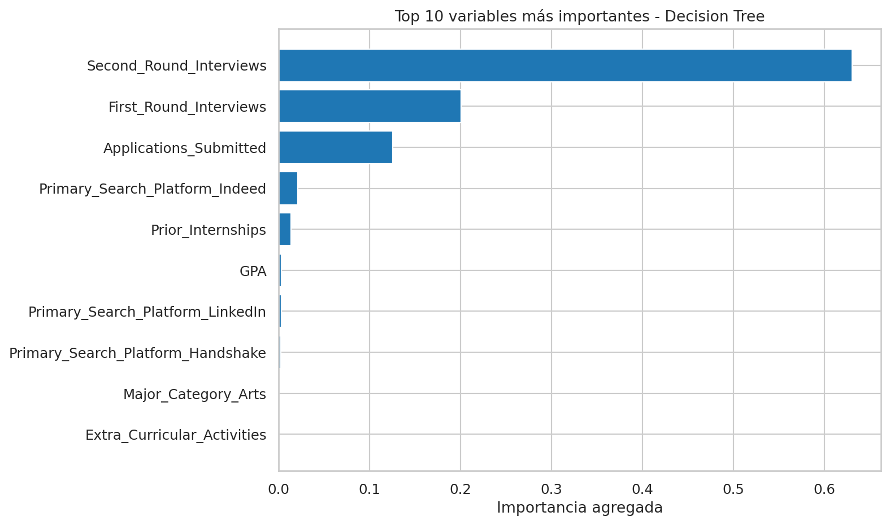

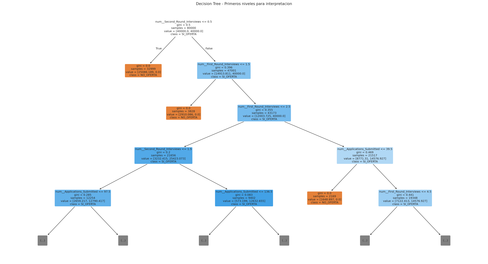

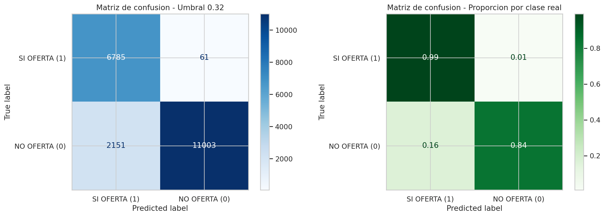

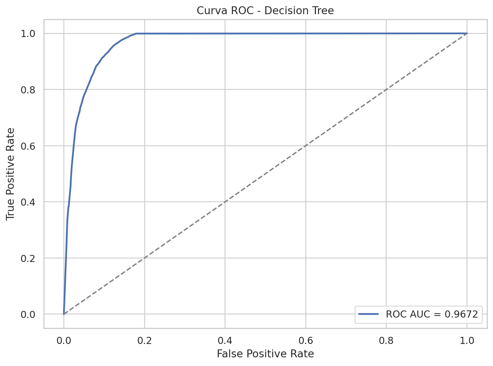

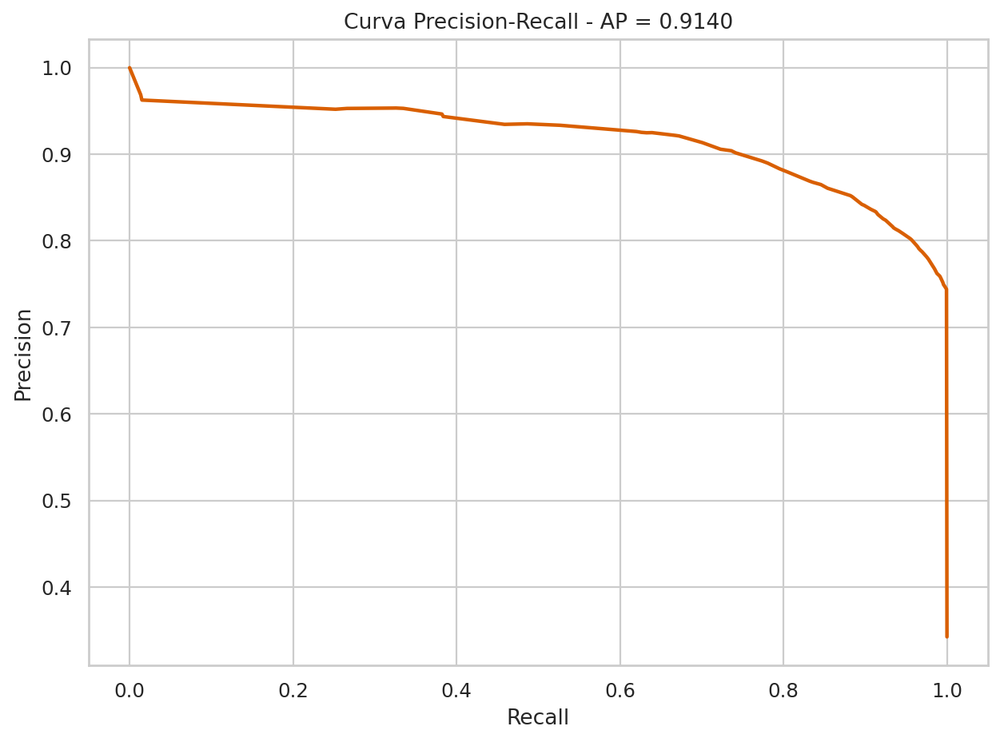

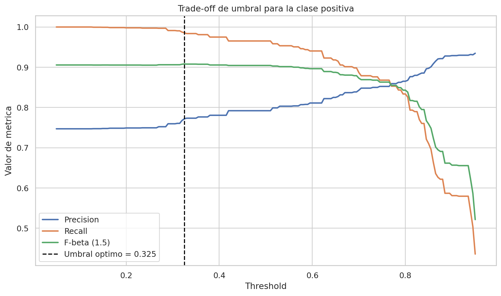

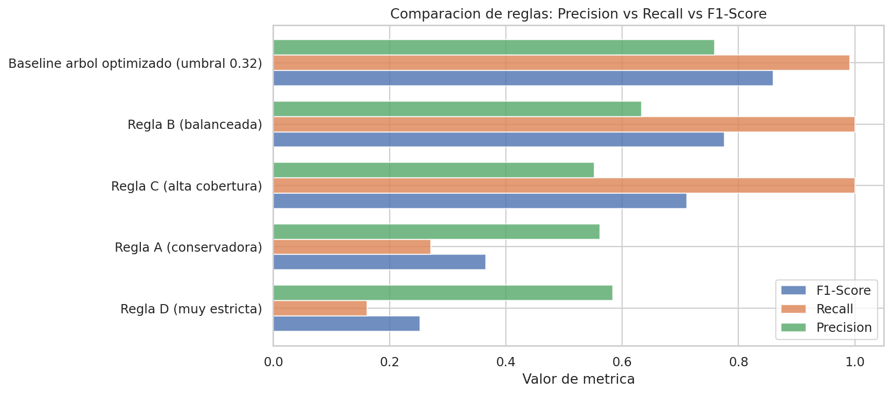

## 3. Lectura ejecutiva de las gráficas

Las gráficas están diseñadas para responder preguntas de negocio, no para mostrar sintaxis:

- ¿El modelo separa bien a quienes sí reciben oferta? Eso se ve en la curva ROC.
- ¿Sirve realmente cuando la clase importante es `SI OFERTA (1)`? Eso se ve mejor en la curva Precision-Recall.
- ¿Qué sucede si cambiamos la regla de decisión? Eso se ve en el barrido de umbral.
- ¿Qué variable domina la decisión? Eso se ve en la importancia de variables y en la vista parcial del árbol.

### Lo que dicen los números

- En el baseline, el árbol detectaba `96.44%` de los casos positivos reales (`Recall = 0.9644`).
- En el modelo mejorado, esa cobertura subió a `99.11%` (`Recall = 0.9911`).
- La `ROC-AUC` se mantuvo en `0.9672`, así que el árbol ya separaba muy bien desde el inicio.
- El `F-beta (1.5)` subió de `0.9042` a `0.9060`, una mejora pequeña pero real en favor del objetivo del proyecto.

En términos ejecutivos: el modelo mejorado dejó pasar menos ofertas reales. A cambio, marcó algunos casos extra como positivos, por eso bajaron ligeramente la precisión y la exactitud global.

## 4. Qué aporta el baseline

El baseline responde a la pregunta de control: ¿qué tan bien funciona el árbol antes de la optimización fina? Esa referencia sirve para comparar de manera objetiva y mostrar si el ajuste posterior aporta valor.

### Baseline en una frase

La versión base ya separa bien las clases y deja una señal fuerte sobre la clase positiva, pero todavía había margen para mejorar la captura de casos reales de oferta.

### Lectura visual del baseline

La matriz de confusión muestra el comportamiento original del árbol. La curva ROC resume su capacidad de separación con un valor muy alto de `0.9672`, lo que significa que el árbol ya distinguía muy bien entre clases. La curva Precision-Recall es especialmente útil porque la clase positiva es la relevante, y el barrido de umbral muestra el efecto operativo de mover la frontera de decisión.

En términos sencillos, el baseline ya funcionaba bien, pero todavía dejaba pasar algunos casos positivos que interesaba capturar.

## 5. Qué cambia en el modelo mejorado

La versión mejorada conserva la estructura del árbol, pero incorpora dos ajustes que cambian la salida final:

1. Búsqueda de hiperparámetros con validación cruzada.
2. Ajuste del umbral para priorizar `SI OFERTA (1)`.

### Qué hace cada mejora

- La búsqueda de hiperparámetros prueba varias configuraciones del árbol para quedarse con la que mejor generaliza.
- El ajuste del umbral vuelve más sensible la decisión final para no perder ofertas reales.

Además, incorpora piezas de interpretación que ayudan a la presentación:

- importancia agregada de variables,
- vista parcial del árbol,
- comparación con reglas manuales inspiradas en los splits.

### ¿Sirvió la mejora?

Sí, para el objetivo principal sí sirvió. La mejora no subió mucho la precisión global, pero sí aumentó el recall de `96.44%` a `99.11%`, que es justamente lo que importa si el costo de perder un caso positivo es alto. En otras palabras: el árbol mejorado marcó algunos positivos adicionales, pero dejó pasar muchos menos casos reales de oferta.

## 6. Resultados cuantitativos

### Baseline con umbral 0.50

- `Accuracy = 0.9015`
- `Precision = 0.7928`
- `Recall = 0.9644`
- `F1-Score = 0.8702`
- `F-beta (1.5) = 0.9042`
- `ROC-AUC = 0.9672`
- `Average Precision = 0.9140`

### Modelo mejorado con umbral óptimo

- `Accuracy = 0.8894`
- `Precision = 0.7593`
- `Recall = 0.9911`
- `F1-Score = 0.8598`
- `F-beta (1.5) = 0.9060`
- `ROC-AUC = 0.9672`
- `Average Precision = 0.9140`

### Lectura ejecutiva

La mejora sube el recall y mantiene un nivel alto de precisión. Si el objetivo del negocio es no perder ofertas reales, esta es la dirección correcta: sacrificar una parte pequeña de la precisión para capturar más positivos.

En términos prácticos: el modelo mejorado es más adecuado para detectar oportunidades, aunque exige revisar un poco más de falsos positivos. Para este proyecto eso es aceptable, porque la prioridad era no dejar pasar casos que sí recibían oferta.

## 7. Qué explica el árbol

El árbol no se interpreta con coeficientes, sino con divisiones e importancia de variables.

### Variables más importantes

- `Second_Round_Interviews`
- `First_Round_Interviews`
- `Applications_Submitted`
- `Primary_Search_Platform_Indeed`
- `Prior_Internships`
- `GPA`

### Lectura operativa

Las primeras divisiones del árbol están dominadas por el avance en entrevistas. Eso sugiere una lectura muy alineada con el negocio: cuando el proceso avanza a segundas rondas, la probabilidad de oferta sube con fuerza; cuando no avanza, el árbol empuja hacia la clase negativa.

La gráfica del árbol es útil porque muestra una ruta simple para explicar el modelo a personas no técnicas: si un candidato no llega a segunda ronda, el árbol ya lo empuja con fuerza hacia `NO OFERTA`; si sí llega, la probabilidad cambia de forma importante.

## 8. Interpretación de las gráficas

### Baseline

Las gráficas del baseline dejan ver el comportamiento original del árbol sin intervención adicional. Son útiles para explicar de dónde partió el análisis y por qué se necesitó calibrar el modelo.

- la matriz de confusión muestra que ya había una base sólida,
- la ROC confirma que el árbol separa muy bien las clases,
- la Precision-Recall ayuda a verificar si la clase positiva estaba bien capturada,
- el barrido de umbral explica por qué mover la regla final era una mejora útil.

### Mejorado

Las gráficas del modelo mejorado muestran la solución final:

- la importancia agregada revela las variables dominantes,
- la vista parcial del árbol ayuda a explicar decisiones,
- la comparación con reglas manuales muestra si una regla simple compite con el árbol,
- las curvas ROC y Precision-Recall respaldan el comportamiento global,
- el barrido de umbral justifica la elección de 0.32.

En una frase: el árbol mejorado no cambió radicalmente la forma de separar las clases, pero sí tomó una decisión más útil para negocio al priorizar mejor la clase positiva.

## 9. Artefacto `.pkl`

Cada `.pkl` guarda el pipeline y la metadata necesaria para ejecutar inferencia sin reentrenar.

### Contenido principal

- `pipeline`
- `best_threshold`
- `best_params`
- `feature_columns`
- `numeric_columns`
- `categorical_columns`
- `metrics_default_threshold`
- `metrics_optimized_threshold`
- `threshold_preview`
- `model_stage`

## 10. Ejemplo de uso con `entradas`

```python
import pickle
from pathlib import Path
import pandas as pd

MODEL_PATH = Path("decision_tree_offer_received_improved.pkl")

with open(MODEL_PATH, "rb") as f:
	artifact = pickle.load(f)

modelo = artifact["pipeline"]
umbral = artifact["best_threshold"]
feature_columns = artifact["feature_columns"]

entradas = pd.DataFrame([{
	"GPA": 3.1,
	"University_Rating": "Top-tier",
	"Major_Category": "STEM",
	"Region": "West",
	"Prior_Internships": 2,
	"Extra_Curricular_Activities": 1,
	"Networking_Events_Attended": 3,
	"School_Size": "Medium",
	"Primary_Search_Platform": "LinkedIn",
	"Months_Searching": 5,
	"Applications_Submitted": 20,
	"First_Round_Interviews": 4,
	"Second_Round_Interviews": 2,
}])

entradas = entradas[feature_columns]

probabilidad = modelo.predict_proba(entradas)[:, 1][0]
prediccion = int(probabilidad >= umbral)
porcentaje_seguridad = probabilidad * 100

print("prediccion:", prediccion)
print("probabilidad_clase_1:", round(probabilidad, 4))
print("porcentaje_seguridad:", round(porcentaje_seguridad, 2), "%")
```

## 11. Comparación con reglas manuales

El notebook no solo evalúa el árbol, también contrasta su comportamiento contra reglas simples construidas a partir de las variables más influyentes. Eso sirve para responder una pregunta práctica: ¿se puede explicar una parte del comportamiento con reglas de negocio simples?

La respuesta es que algunas reglas capturan patrones útiles, pero el árbol sigue siendo la opción más completa para combinar señales en distintos niveles.

## 12. Cierre ejecutivo

La conclusión principal es que el árbol ofrece una solución muy sólida para este problema y, además, deja una narrativa clara para presentar: baseline, mejora, visualizaciones y salida serializada.

La versión mejorada es la recomendada para uso operativo porque sí cumplió el objetivo principal: capturar mejor la clase `SI OFERTA (1)`. La baseline queda como referencia metodológica y como respaldo para comparar futuras iteraciones.
