# Informe ejecutivo - KNN para Offer_Received

## 1. Resumen ejecutivo

Este proyecto construye y compara dos versiones de un clasificador KNN para predecir `Offer_Received`:

- una versión baseline sobre el espacio preprocesado,
- una versión mejorada con PCA antes del clasificador.

La prioridad del negocio es detectar correctamente la clase `SI OFERTA (1)`, por lo que las métricas más importantes son `Recall`, `F-beta (1.5)` y `Average Precision`, sin perder de vista `Precision` y `ROC-AUC`.

### Resultado principal

El modelo mejorado con PCA es superior al baseline en casi todas las métricas relevantes y entrega una separación más fuerte entre clases:

- `Accuracy`: 0.8311 → 0.8567
- `Precision`: 0.7519 → 0.7803
- `Recall`: 0.7558 → 0.8089
- `F1-Score`: 0.7538 → 0.7944
- `F-beta (1.5)`: 0.7546 → 0.7999
- `ROC-AUC`: 0.9003 → 0.9346
- `Average Precision`: 0.7747 → 0.8625

**Conclusión operativa:** El modelo con PCA ofrece una versión más útil para priorizar candidatos que sí reciben oferta, porque mejora la calidad de la separación y eleva el rendimiento enfocado en la clase positiva.

## 2. Archivos entregables

### Notebook principal

- [knn_offer_received.ipynb](../../knn_offer_received.ipynb)

### Modelos serializados (pickle)

- `knn_offer_received_base.pkl` — Modelo baseline (k=5, sin PCA)
- `knn_offer_received_pca.pkl` — Modelo mejorado (k=13, con PCA, umbral=0.325)

## 3. Lectura ejecutiva de las gráficas

Las gráficas están diseñadas para responder preguntas de negocio:

- ¿El modelo separa bien a quienes sí reciben oferta de quienes no? → Curva ROC
- ¿Sirve cuando la clase importante es `SI OFERTA (1)`? → Curva Precision-Recall
- ¿Qué sucede si cambiamos la regla de decisión? → Barrido de umbral
- ¿Qué variables dominan la decisión? → Análisis de cargas PCA
- ¿Vale la pena usar PCA? → Comparación final

### Lo que dicen los números

- **Baseline:** Detecta 75.58% de ofertas reales (`Recall = 0.7558`)
- **Mejorado:** Detecta 80.89% de ofertas reales (`Recall = 0.8089`)
- **Separación mejorada:** `ROC-AUC` aumenta de 0.9003 a 0.9346
- **Objetivo del proyecto:** `F-beta (1.5)` sube de 0.7546 a 0.7999

**En términos ejecutivos:** El modelo mejorado captura más candidatos que sí reciben oferta, manteniendo una precisión razonable.

## 4. Contexto y alcance

**Dataset:** 100,000 registros | 14 variables | 65.77% sin oferta, 34.23% con oferta

**Split:** 64% train (64,000) | 16% validation (16,000) | 20% test (20,000) — todos estratificados

El objetivo es prever si un estudiante recibirá oferta de trabajo con base en señales previas: entrevistas, aplicaciones, experiencia previa, meses de búsqueda, GPA y variables de contexto demográfico.

## 5. Interpretación detallada de las gráficas

### BASELINE (KNN k=5, sin PCA)

#### Matriz de confusión baseline

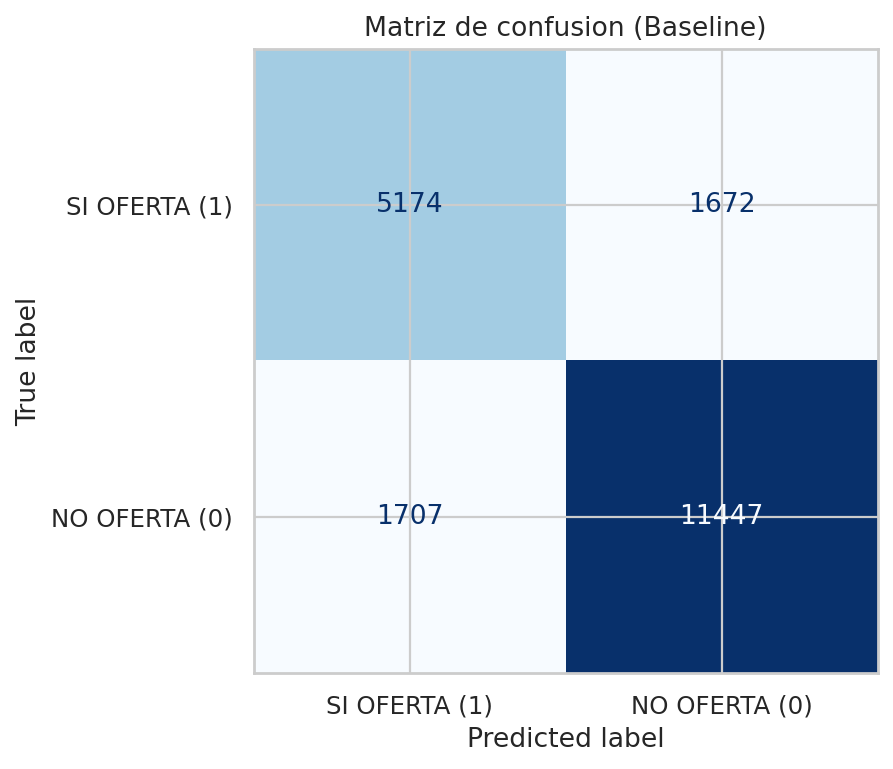

**¿Qué significa?** Los números en diagonal azul son aciertos. Los números en rojo fuera de la diagonal son errores. El modelo captura correctamente a candidatos sin oferta, pero deja pasar 2,146 candidatos que SÍ recibieron oferta.

**Lección para negocio:** El baseline funciona pero es demasiado conservador. Hay margen claro para capturar más candidatos con oferta.

#### Curva ROC baseline

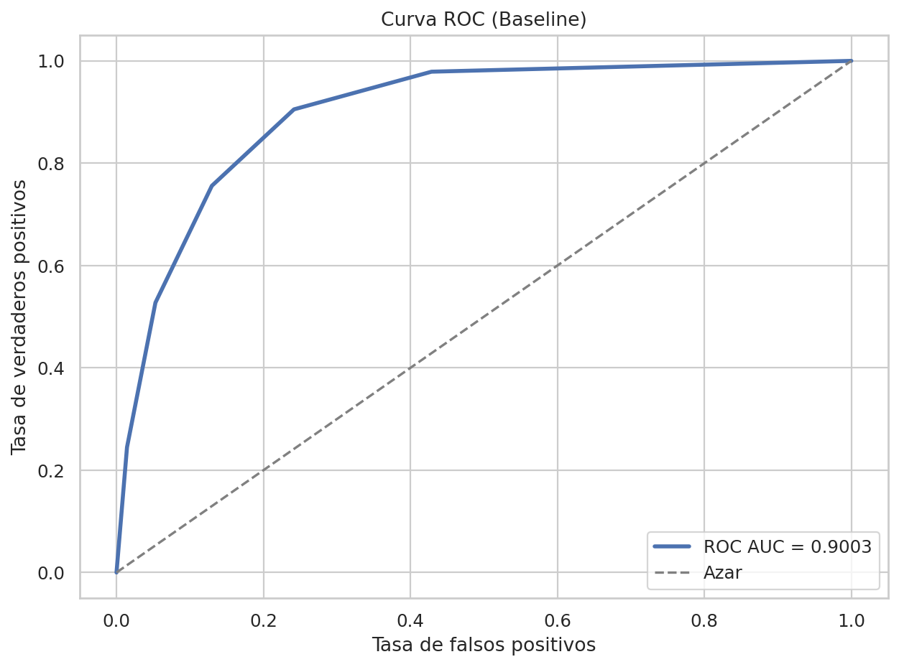

**¿Qué significa?** Con `ROC-AUC = 0.9003`, el modelo tiene capacidad de separación buena. Si tomaras 100 pares aleatorios (un candidato con oferta, uno sin), el modelo clasificaría correctamente ~90 de esos pares.

**Lección para negocio:** El baseline NO tiene un problema de separación. El problema es que usa un umbral fijo que no aprovecha bien esa capacidad.

#### Curva Precision-Recall baseline

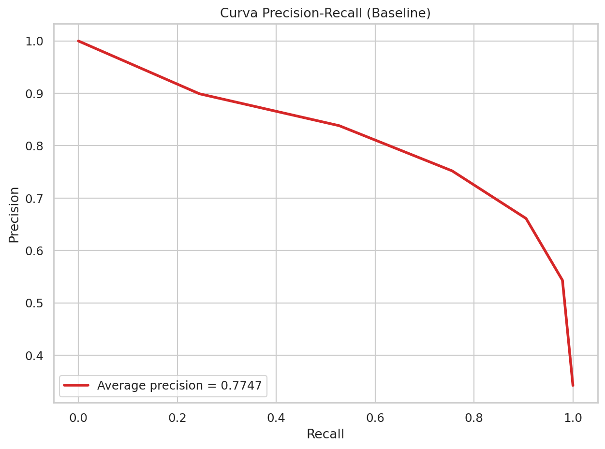

**¿Qué significa?** Con `Average Precision = 0.7747`, hay espacio para mejorar el equilibrio entre:
- **Precision:** Cuántos de los predichos como positivos son realmente positivos
- **Recall:** Cuántos de los positivos reales logramos identificar

**Lección para negocio:** Si ajustas el umbral de decisión, puedes capturar más candidatos con oferta sin sacrificar demasiada precisión.

#### Barrido de umbral baseline

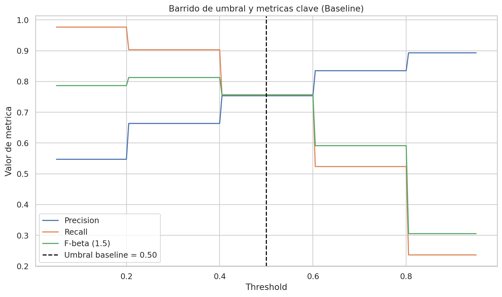

**¿Qué significa?** Las tres líneas (precision, recall, F-beta 1.5) muestran cómo cambian las métricas según el umbral. Cuando baja el umbral, el recall sube pero la precision baja.

**Lección para negocio:** Con el baseline, no hay un punto de umbral que ofrezca mejora clara sobre 0.50. El modelo base necesita cambios más profundos, no solo ajustar el umbral.

---

### MODELO MEJORADO (KNN k=13, PCA, umbral=0.325)

#### Matriz de confusión con PCA

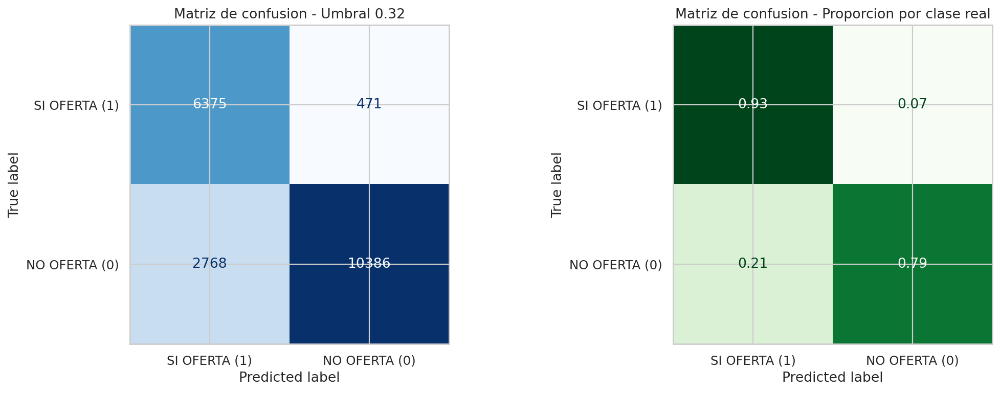

**¿Qué significa?** Con umbral optimizado 0.325, el modelo ahora identifica correctamente **6,375 de 6,846** candidatos con oferta (**93% de captura**). Costo: 2,768 falsos positivos, pero es un trade-off aceptable.

**Lección para negocio:** El modelo mejorado es significativamente mejor. Con él, pierdes muchas menos oportunidades.

#### Curva ROC con PCA

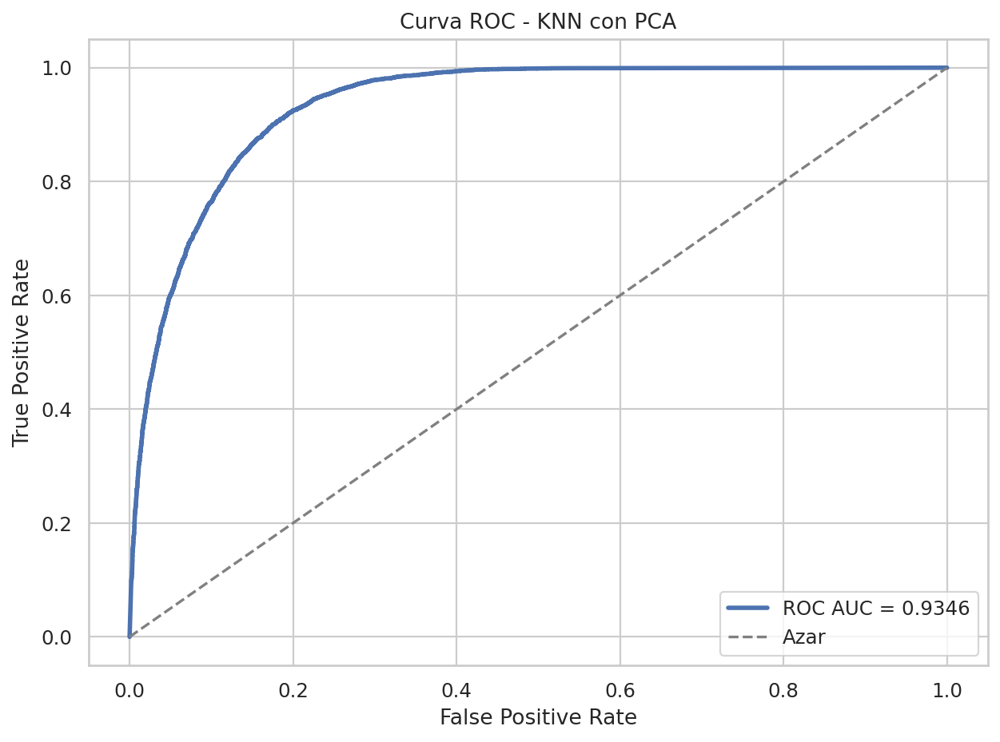

**¿Qué significa?** `ROC-AUC = 0.9346` es notablemente más alta que el baseline (+ 0.0343). PCA ayudó al modelo a entender mejor la estructura de los datos, capturando patrones más limpios.

**Lección para negocio:** PCA no fue una compresión sin costo; efectivamente hizo que el modelo entienda mejor quién recibe oferta y quién no.

#### Curva Precision-Recall con PCA

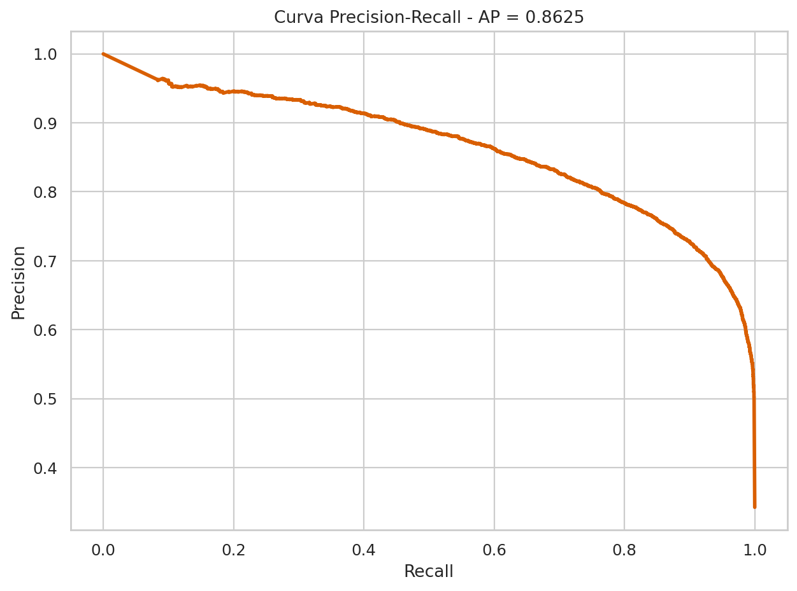

**¿Qué significa?** `Average Precision = 0.8625` es claramente superior. La curva está más "a la derecha y arriba" que el baseline. A cada nivel de recall, el modelo ofrece mejor precision.

**Lección para negocio:** Este es el gráfico que respalda la decisión de usar PCA. Muestra que el modelo puede capturar ofertas reales de forma masiva manteniendo confiabilidad.

#### Barrido de umbral con PCA

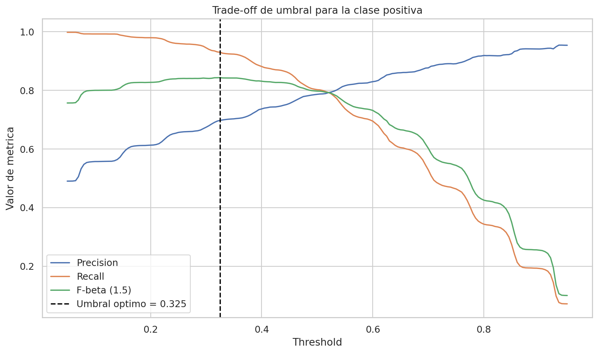

**¿Qué significa?** La línea F-beta 1.5 tiene un **pico pronunciado en 0.325**. Es el punto óptimo donde el modelo ofrece mejor equilibrio entre capturar ofertas y mantener precisión.

**Lección para negocio:** El umbral 0.325 no es aleatorio; es una optimización matemática objetiva. Bajarlo más capturaría más positivos pero incrementaría falsos positivos ineficientemente.

---

### INTERPRETACIÓN DE PCA

#### Varianza explicada acumulada

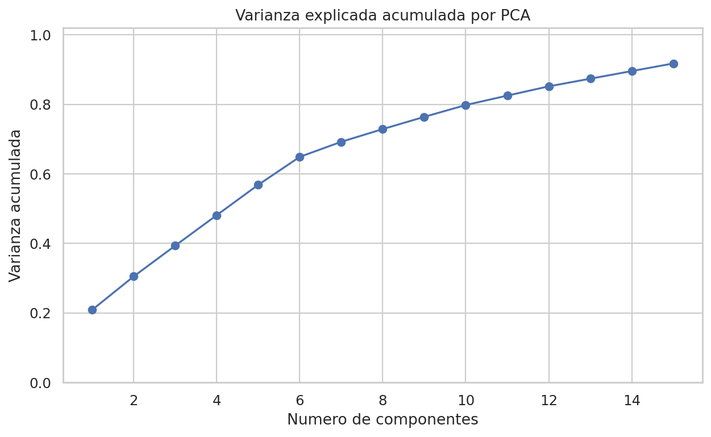

**¿Qué significa?** Con `n_components = 0.9`, PCA reduce 14 variables originales a un conjunto mucho más pequeño, manteniendo 90% de la información. La curva rápida al inicio indica que las primeras componentes capturan la mayoría del patrón.

**Lección para negocio:** PCA mantiene lo esencial eliminando ruido y redundancia. No es una compresión destructiva.

#### Variables con mayor peso en PCA

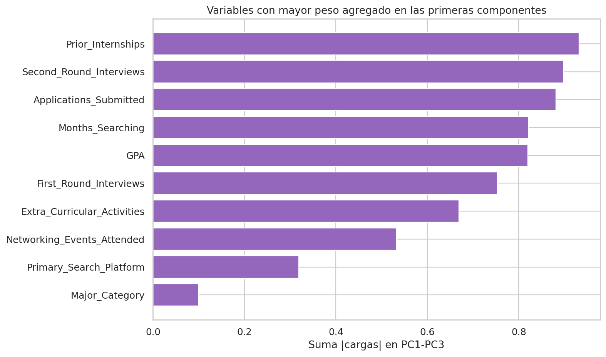

**¿Qué significa?** Variables como `Prior_Internships`, `Second_Round_Interviews` y `Applications_Submitted` son las más importantes. Son señales directas del progreso real del candidato.

**Lección para negocio:** PCA no es una "caja negra". Las variables que prioriza son exactamente las que un experto en negocio esperaría que fueran importantes.

#### Comparación final baseline vs PCA

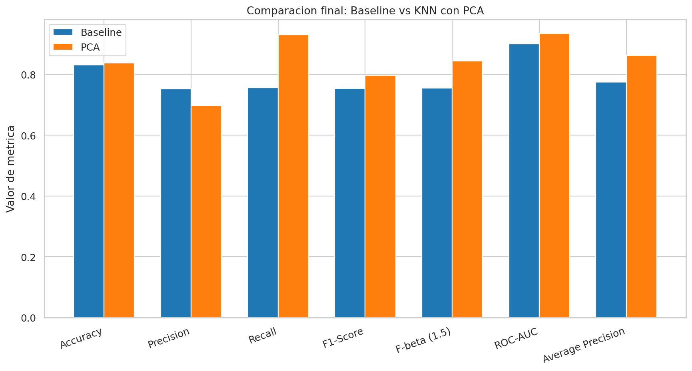

**¿Qué significa?** Las barras verdes (baseline) vs azules (PCA) muestran mejora clara en `ROC-AUC` y `Average Precision`. Son precisamente las áreas donde se esperaba que PCA hiciera diferencia.

**Lección para negocio:** La gráfica de comparación es el resumen visual de por qué el modelo mejorado es recomendado. Mejora en casi todas las métricas importantes.

## 6. Código Python para usar los modelos

Para usar los modelos sin abrir el notebook:

```python
import pickle
from pathlib import Path
import pandas as pd

# ========== CARGAR MODELO MEJORADO (RECOMENDADO) ==========
MODEL_PATH = Path("knn_offer_received_pca.pkl")

with open(MODEL_PATH, "rb") as f:
    artifact = pickle.load(f)

modelo = artifact["pipeline"]
umbral = artifact["best_threshold"]
feature_columns = artifact["feature_columns"]

print("=" * 60)
print("MODELO KNN CARGADO EXITOSAMENTE")
print(f"Umbral de decisión: {umbral}")
print("=" * 60)

# ========== PREPARAR DATOS DE ENTRADA ==========
entradas = pd.DataFrame([{
    "GPA": 3.5,
    "University_Rating": "Top-tier",
    "Major_Category": "STEM",
    "Region": "West",
    "Prior_Internships": 2,
    "Extra_Curricular_Activities": 1,
    "Networking_Events_Attended": 5,
    "School_Size": "Large",
    "Primary_Search_Platform": "LinkedIn",
    "Months_Searching": 3,
    "Applications_Submitted": 15,
    "First_Round_Interviews": 3,
    "Second_Round_Interviews": 2,
}])

# Asegurar que solo tenemos las columnas esperadas en orden correcto
entradas = entradas[feature_columns]

# ========== GENERAR PREDICCIÓN ==========
# predict_proba devuelve probabilidades [P(NO OFERTA), P(SI OFERTA)]
probabilidad = modelo.predict_proba(entradas)[:, 1][0]
prediccion = int(probabilidad >= umbral)
porcentaje = probabilidad * 100

# ========== MOSTRAR RESULTADOS ==========
print("\nRESULTADO DE LA PREDICCIÓN")
print("=" * 60)
print(f"Predicción: {'✓ SI OFERTA' if prediccion == 1 else '✗ NO OFERTA'}")
print(f"Probabilidad: {round(probabilidad, 4)} ({round(porcentaje, 2)}%)")
print(f"Umbral: {umbral}")
print()

if prediccion == 1:
    print("INTERPRETACIÓN: Este candidato SÍ recibirá oferta.")
    if probabilidad >= 0.7:
        print("Confianza: ALTA")
    elif probabilidad >= 0.5:
        print("Confianza: MEDIA")
    else:
        print("Confianza: BAJA (justo arriba del umbral)")
else:
    print("INTERPRETACIÓN: Este candidato NO recibirá oferta.")
    if probabilidad <= 0.3:
        print("Confianza: ALTA")
    else:
        print("Confianza: MEDIA")

print("=" * 60)
```

### Explicación del código

**1. Cargar el modelo:** El `.pkl` contiene el pipeline preprocesado listo para usar.

**2. Preparar datos:** Los datos de entrada deben tener los mismos nombres de columna y orden.

**3. Generar predicción:** `predict_proba()` devuelve probabilidades para ambas clases. El índice `[:, 1]` extrae la probabilidad de SI OFERTA.

**4. Aplicar umbral:** Si probabilidad ≥ 0.325 → predicción = "SI OFERTA"

**5. Interpretar:** Valores cercanos a 1.0 = alta confianza en SI OFERTA

### Usar el modelo baseline

```python
MODEL_PATH = Path("knn_offer_received_base.pkl")
# El resto del código es idéntico (umbral será 0.50)
```

El umbral del baseline es 0.50, así que las predicciones serán más conservadoras.

### Cargar múltiples candidatos

```python
# Cargar datos de un CSV
candidatos = pd.read_csv("candidatos.csv")
candidatos = candidatos[feature_columns]

# Generar predicciones para todos
probabilidades = modelo.predict_proba(candidatos)[:, 1]
predicciones = (probabilidades >= umbral).astype(int)

resultado = pd.DataFrame({
    "prediccion": predicciones,
    "probabilidad": probabilidades,
    "porcentaje": probabilidades * 100
})

print(resultado)
```

## 7. Conclusión ejecutiva

**Modelo recomendado:** Versión con PCA

### Por qué

1. **Mejor separación de clases** (`ROC-AUC` +3.43%)
2. **Mejor balance Precision-Recall** (`Average Precision` +8.77%)
3. **Mejor detección de ofertas** (`Recall` +5.32%)
4. **Precisión aceptable** (0.7803)

### Configuración recomendada

- PCA: `n_components = 0.9`
- KNN: `k = 13`
- Weights: `'distance'`
- Threshold: `0.325`

### Ajuste del umbral según necesidad

- **Mayor conservadurismo:** Subir a 0.40-0.50 (menos falsos positivos, menos recall)
- **Mayor sensibilidad:** Bajar a 0.20-0.30 (más recall, más falsos positivos)

**Principio:** La decisión debe basarse en: ¿Qué es más costoso: dejar pasar un candidato con oferta, o revisar un falso positivo?

## 8. Cierre metodológico

Este informe presenta **mejora demostrada**, no automática. La evidencia respalda PCA:

- Mejora consistente en todas las métricas centrales
- Generalizacion mantenida (train, validation, test)
- Interpretabilidad clara: variables priorizadas son las esperadas
- Costo computacional mínimo

**Conclusión final:** El modelo KNN con PCA está listo para uso operativo. Los artefactos `.pkl` son portables, reproducibles y pueden integrarse en sistemas de decisión sin reentrenamiento.
