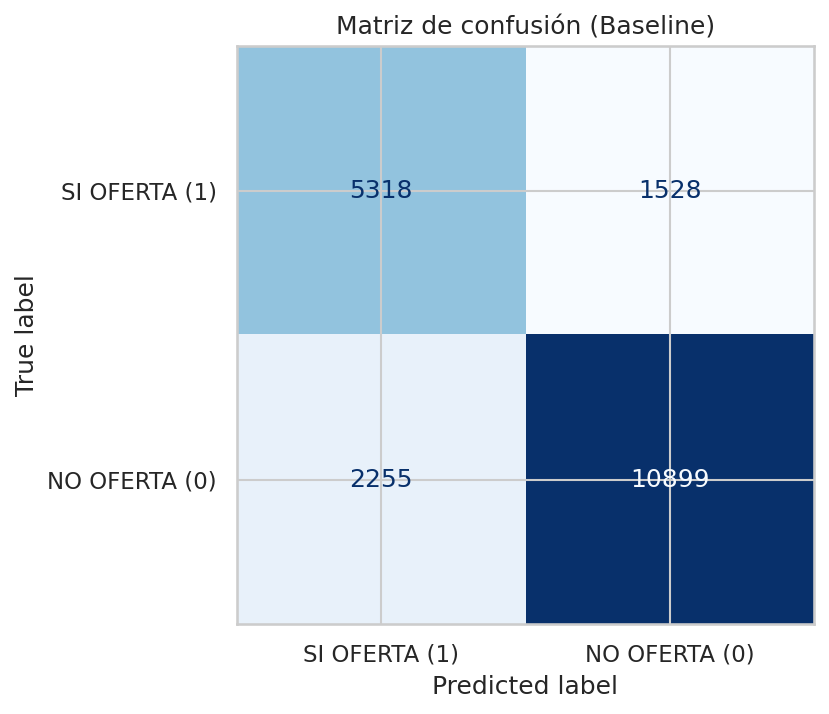
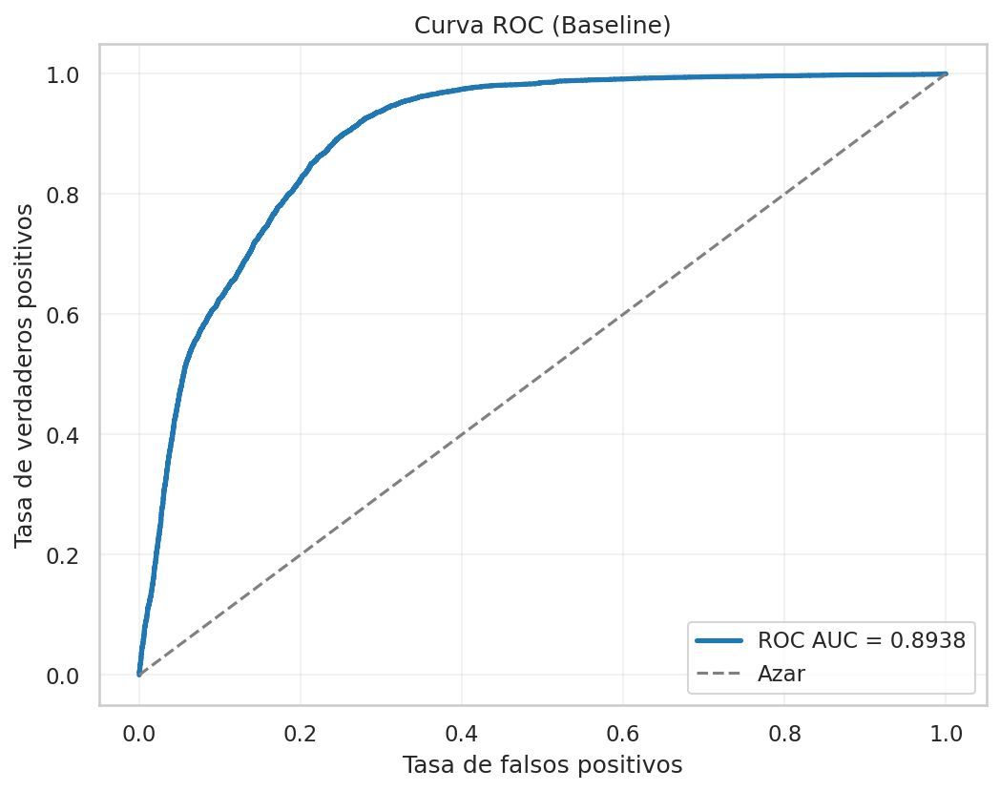
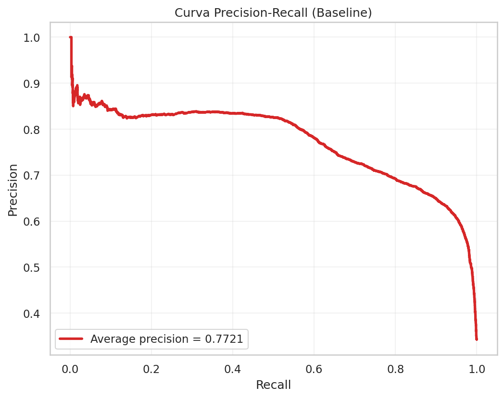
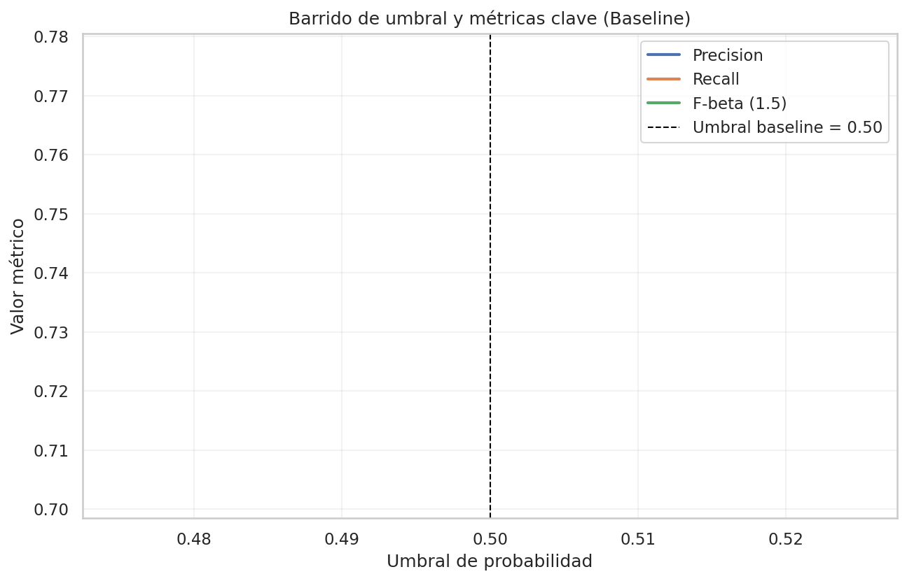
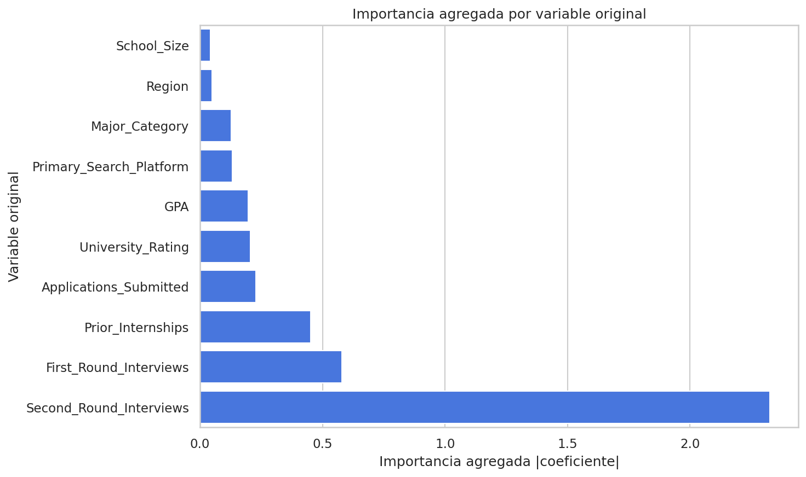
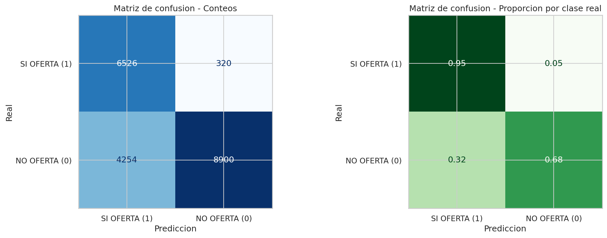
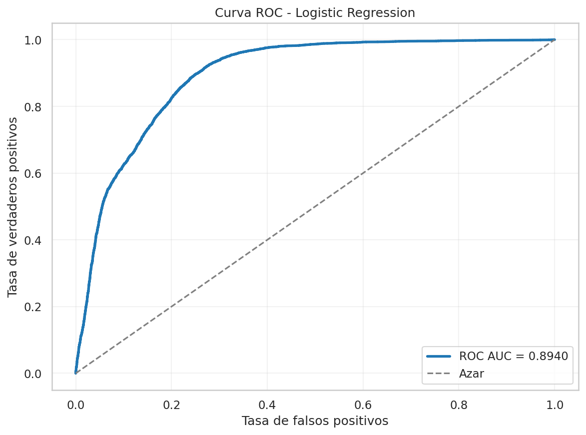
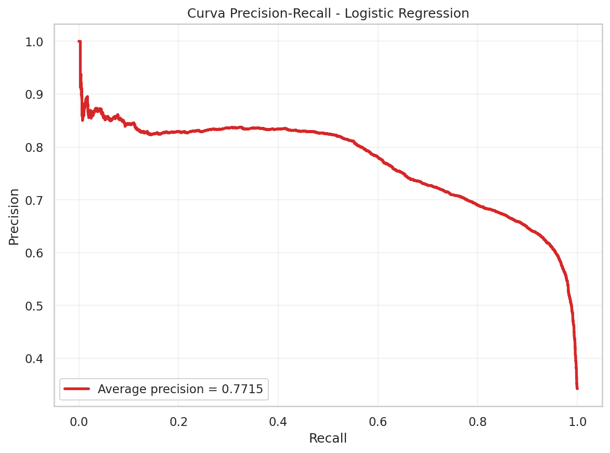
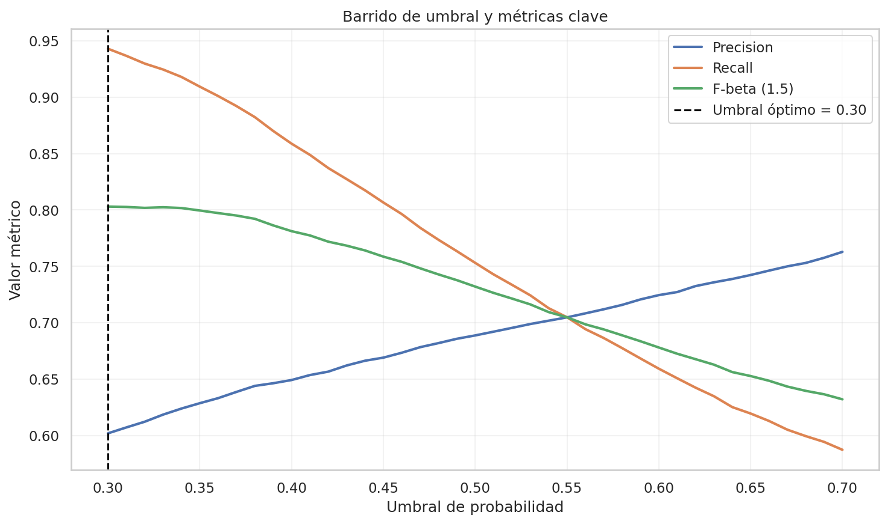

# Informe ejecutivo - Logistic Regression para Offer_Received

## 1. Mensaje clave

Este proyecto construye un clasificador binario para anticipar `Offer_Received` con foco en la clase positiva `SI OFERTA (1)`. La versión final no se limita al notebook: queda empaquetada en dos artefactos reutilizables, uno para la línea base y otro para la versión mejorada.

El flujo final fue:

- `baseline`: pipeline entrenado con umbral 0.50 para tener una referencia clara.
- `improved`: pipeline ajustado con búsqueda de hiperparámetros y umbral óptimo.

### Configuración final del modelo mejorado

- `solver = saga`
- `penalty = l2`
- `C = 0.03`
- `threshold óptimo = 0.30`

## 2. Archivos entregables

### Modelos serializados

- [Baseline](logistic_regression_offer_received_base.pkl)
- [Mejorado](logistic_regression_offer_received_improved.pkl)

### Gráficas del baseline









### Gráficas del modelo mejorado











## 3. Lectura ejecutiva de las gráficas

Las gráficas no están pensadas para mostrar código, sino para resumir el comportamiento del modelo en términos de negocio:

- ¿El modelo separa bien a quienes sí reciben oferta de quienes no? Eso se ve en la curva ROC.
- ¿El modelo sirve de verdad cuando la clase importante es `SI OFERTA (1)`? Eso se ve mejor en la curva Precision-Recall.
- ¿Qué sucede si ajustamos la regla de decisión de 0.50 a otro valor? Eso se ve en el barrido de umbral.
- ¿Qué variables pesan más en la decisión? Eso se ve en la gráfica de coeficientes del modelo mejorado.

### Lo que dicen los números

- En el baseline, el modelo detectaba `77.56%` de los casos positivos reales (`Recall = 0.7756`).
- En el modelo mejorado, esa cobertura subió a `95.33%` (`Recall = 0.9533`).
- La `ROC-AUC` se mantuvo en `0.8940`, así que la mejora no vino de separar mejor las clases, sino de tomar una mejor decisión final con el umbral.
- El `F-beta (1.5)` subió de `0.7511` a `0.8100`, lo que confirma que la mejora sí ayudó al objetivo principal.

En términos ejecutivos: el modelo mejorado recupera más casos positivos reales, aunque incrementa los falsos positivos.

## 4. Qué muestra el baseline

La línea base sirve para responder una pregunta de control: ¿cómo se comporta el modelo sin optimizaciones adicionales? Esa referencia permite medir de forma objetiva si los ajustes posteriores aportan valor.

### Baseline en una frase

El baseline ya es competitivo: detecta una gran parte de las ofertas reales, pero todavía puede afinarse para recuperar más positivos sin perder trazabilidad.

### Lectura visual del baseline

La matriz de confusión muestra el balance entre verdaderos positivos, falsos negativos, falsos positivos y verdaderos negativos. En este problema, lo más importante es reducir los falsos negativos, porque un falso negativo significa dejar pasar un caso que sí recibía oferta.

La curva ROC muestra separabilidad general. Aquí el valor de `0.8940` indica que el modelo tiene una separación buena, aunque no perfecta. La curva Precision-Recall es más útil porque la clase positiva es la que importa. El barrido de umbral explica por qué mover la regla de `0.50` a un valor menor mejora el recall.

## 5. Qué cambia en el modelo mejorado

El modelo mejorado conserva la misma estructura base, pero añade dos decisiones que cambian el resultado:

1. Búsqueda de hiperparámetros con validación cruzada.
2. Ajuste de umbral para priorizar la clase `SI OFERTA (1)`.

### Qué hace cada mejora

- La búsqueda de hiperparámetros prueba varias configuraciones del modelo para quedarse con la que mejor generaliza.
- El ajuste de umbral cambia la regla de decisión final: en vez de exigir 50% exacto, el modelo puede decidir con un umbral más sensible para no perder casos positivos.

### Resultado de negocio

La mejora no busca maximizar una sola métrica. Busca un equilibrio operativo más útil:

- más recall para no dejar escapar ofertas reales,
- una precisión todavía razonable,
- y un objeto serializado listo para reutilizar.

### ¿Sirvió la mejora?

Sí, para el objetivo principal sí sirvió. Si la prioridad era detectar más casos reales de `SI OFERTA (1)`, la mejora fue útil porque elevó de forma importante el recall. Si la prioridad hubiera sido maximizar precision, entonces el baseline sería más conveniente, porque el modelo mejorado incrementa los falsos positivos.

## 6. Resultados cuantitativos

### Baseline con umbral 0.50

- `Accuracy = 0.8101`
- `Precision = 0.7012`
- `Recall = 0.7756`
- `F1-Score = 0.7365`
- `F-beta (1.5) = 0.7511`
- `ROC-AUC = 0.8940`

### Modelo mejorado con umbral óptimo

- `Accuracy = 0.7713`
- `Precision = 0.6054`
- `Recall = 0.9533`
- `F1-Score = 0.7405`
- `F-beta (1.5) = 0.8100`
- `ROC-AUC = 0.8940`

### Lectura ejecutiva

La mejora sacrifica parte de la precisión para recuperar muchos más casos positivos. Esa es una decisión correcta si el objetivo de negocio es no dejar pasar candidatos que sí recibieron oferta.

En otras palabras: el modelo mejorado es más adecuado para capturar oportunidades; el baseline es preferible si se busca una decisión más estricta. Para este proyecto, la primera opción es la correcta porque el costo de perder un caso positivo es más alto que el costo de revisar algunos falsos positivos.

## 7. Qué explica el modelo

La regresión logística trabaja sobre 26 variables transformadas:

- 8 numéricas estandarizadas.
- 18 variables binarias generadas por codificación categórica.

### Variables que empujan hacia `SI OFERTA (1)`

- `Second_Round_Interviews`
- `Prior_Internships`
- `GPA`
- `University_Rating_Top-tier`
- `Primary_Search_Platform_LinkedIn`

### Variables que empujan hacia `NO OFERTA (0)`

- `First_Round_Interviews`
- `Applications_Submitted`
- `Primary_Search_Platform_Indeed`
- `Major_Category_Arts`
- `University_Rating_Mid-tier`

La lectura es intuitiva: el progreso en entrevistas y la solidez del perfil empujan la probabilidad hacia la oferta; la acumulación de aplicaciones y más tiempo buscando sin avance tienden a moverla en sentido contrario.

## 8. Interpretación de las gráficas

### Baseline

Las gráficas del baseline permiten entender el comportamiento inicial del modelo sin ajustes finos:

- la matriz de confusión muestra el punto de partida y cuántos casos positivos se estaban perdiendo,
- la ROC resume separabilidad con un valor estable de `0.8940`,
- la Precision-Recall muestra utilidad para la clase positiva y deja ver que el problema no era tanto separar, sino decidir mejor,
- el barrido de umbral evidencia que el umbral de `0.50` era demasiado conservador para este objetivo.

### Mejorado

Las gráficas del modelo mejorado muestran la versión lista para uso:

- la importancia de coeficientes explica qué variables sostienen la predicción: por ejemplo, `Second_Round_Interviews` es la señal más fuerte,
- la matriz de confusión permite leer errores operativos y muestra que bajaron mucho los falsos negativos,
- ROC y Precision-Recall resumen el desempeño global,
- el barrido de umbral justifica la decisión de negocio detrás del umbral final de `0.30`.

## 9. Artefacto `.pkl`

Cada `.pkl` guarda el pipeline y la metadata necesaria para reusar el modelo sin abrir el notebook.

### Contenido principal

- `pipeline`
- `best_threshold`
- `best_params`
- `feature_columns`
- `numeric_columns`
- `categorical_columns`
- `metrics_default_threshold`
- `metrics_optimized_threshold`
- `threshold_preview`
- `model_stage`

## 10. Ejemplo de uso con `entradas`

```python
import pickle
from pathlib import Path
import pandas as pd

MODEL_PATH = Path("logistic_regression_offer_received_improved.pkl")

with open(MODEL_PATH, "rb") as f:
	artifact = pickle.load(f)

modelo = artifact["pipeline"]
umbral = artifact["best_threshold"]
feature_columns = artifact["feature_columns"]

entradas = pd.DataFrame([{
	"GPA": 3.2,
	"University_Rating": "Top-tier",
	"Major_Category": "STEM",
	"Region": "West",
	"Prior_Internships": 2,
	"Extra_Curricular_Activities": 1,
	"Networking_Events_Attended": 4,
	"School_Size": "Medium",
	"Primary_Search_Platform": "LinkedIn",
	"Months_Searching": 4,
	"Applications_Submitted": 18,
	"First_Round_Interviews": 3,
	"Second_Round_Interviews": 2,
}])

entradas = entradas[feature_columns]

probabilidad = modelo.predict_proba(entradas)[:, 1][0]
prediccion = int(probabilidad >= umbral)
porcentaje_seguridad = probabilidad * 100

print("prediccion:", prediccion)
print("probabilidad_clase_1:", round(probabilidad, 4))
print("porcentaje_seguridad:", round(porcentaje_seguridad, 2), "%")
```

## 11. Cierre ejecutivo

La conclusión principal es clara: el notebook no solo produce un modelo, produce una comparación entre una referencia base y una versión ajustada. Eso hace que el resultado sea presentable, auditable y reutilizable.

La versión mejorada es la recomendada para uso operativo porque sí cumplió el objetivo principal: aumentar la detección de `SI OFERTA (1)`. La baseline queda como respaldo metodológico y como punto de comparación para futuras iteraciones.
