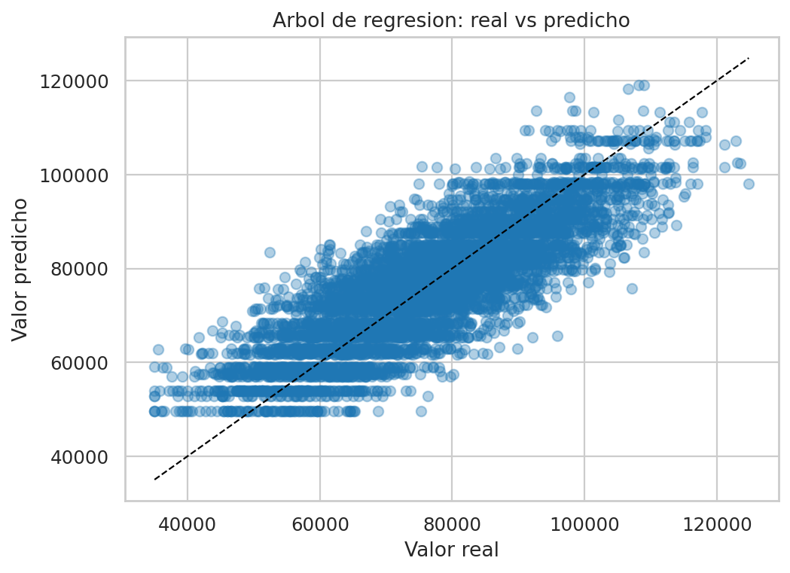
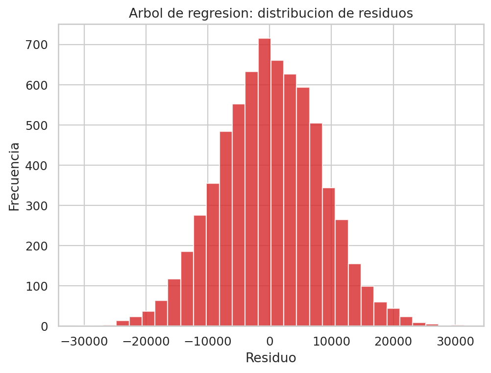
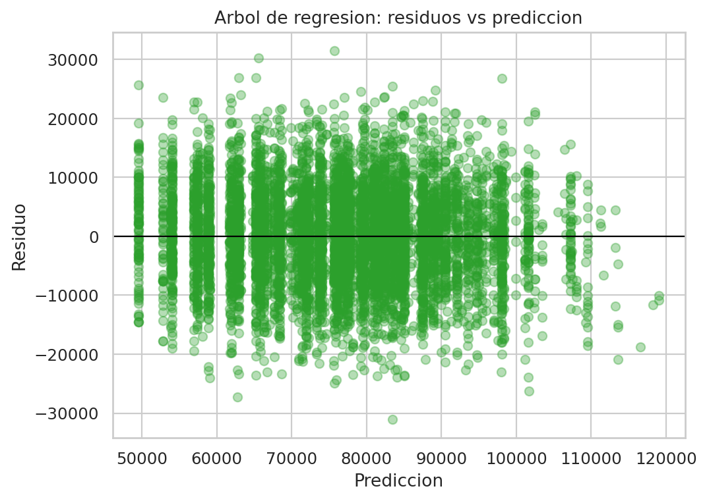
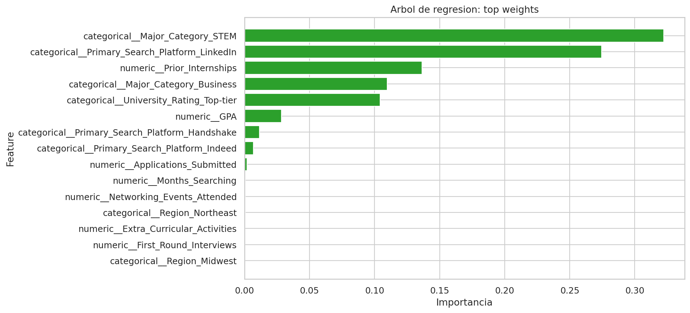

# Informe ejecutivo - Árbol de regresión para Offer_Salary

## 1. Resumen ejecutivo

Este informe documenta el modelo **Árbol de regresión** usado para predecir `Offer_Salary` a partir de `dataset_offer_Salary.csv`.

El árbol permite una lectura intuitiva por reglas de corte, pero su desempeño en este taller quedó por debajo de la familia lineal regularizada.

### Resultado principal

- `MAE test`: 6510.0689
- `RMSE test`: 8152.4855
- `R2 test`: 0.6928
- `RMSE train`: 7930.4046
- `Brecha RMSE (test - train)`: 222.0810

**Lectura operativa:** El árbol aprende reglas útiles, pero su error en prueba crece de forma clara frente al entrenamiento. Eso indica sobreajuste moderado y explica por qué no fue el mejor modelo final.

## 2. Archivos entregables

- Notebook principal: [regresion_offer_salary_completo.ipynb](../../../regresion_offer_salary_completo.ipynb)
- Modelo serializado: `decision_tree_offer_salary.pkl`
- Informe actual: `decision_tree_offer_salary.md`

## 3. Configuracion final del modelo

- `model__max_depth`: `8`
- `model__min_samples_leaf`: `5`
- `model__min_samples_split`: `2`

## 4. Metricas de entrenamiento vs prueba

- **Train**: `MAE=6322.2535` | `RMSE=7930.4046` | `R2=0.7200`
- **Test**: `MAE=6510.0689` | `RMSE=8152.4855` | `R2=0.6928`

La brecha train-test es significativa (`222.0810` en RMSE). Eso confirma que el árbol sí captura patrones útiles, pero su capacidad de generalización es inferior a la de Lasso, Ridge y regresión lineal. El árbol aprende mejor el entrenamiento que la distribución de prueba.

## 5. Lectura ejecutiva de las graficas

### Real vs predicho



El gráfico muestra una dispersión más amplia que la observada en los modelos lineales. Los puntos no se adhieren tanto a la diagonal, lo que refleja una aproximación más irregular del salario real.

### Distribucion de residuos



El histograma de residuos deja ver errores más altos que en la familia lineal. La lectura importante no es solo la magnitud, sino el hecho de que el árbol introduce mayor variabilidad en su predicción.

### Residuos vs prediccion



Este gráfico ayuda a detectar si el árbol está haciendo predicciones sesgadas en ciertos rangos. La presencia de dispersión amplia sugiere que la estructura por reglas no está capturando tan bien el comportamiento continuo del salario como sí lo hacen los modelos regularizados.

### Variables mas influyentes



### Variables con mayor importancia

- `categorical__Major_Category_STEM`: `0.3222`
- `categorical__Primary_Search_Platform_LinkedIn`: `0.2744`
- `numeric__Prior_Internships`: `0.1364`
- `categorical__Major_Category_Business`: `0.1098`
- `categorical__University_Rating_Top-tier`: `0.1044`
- `numeric__GPA`: `0.0283`
- `categorical__Primary_Search_Platform_Handshake`: `0.0116`
- `categorical__Primary_Search_Platform_Indeed`: `0.0070`
- `numeric__Applications_Submitted`: `0.0020`
- `numeric__Months_Searching`: `0.0006`

La importancia confirma que el árbol se apoya en variables coherentes: perfil STEM, LinkedIn, experiencia previa, tipo de universidad y GPA. Sin embargo, que las variables sean lógicas no significa que el ajuste global sea mejor; aquí la calidad del ranking de variables no compensa la pérdida de generalización.


## 6. Uso del modelo serializado

```python
import pickle
from pathlib import Path
import pandas as pd

artifact_path = Path('decision_tree_offer_salary.pkl')
with open(artifact_path, 'rb') as f:
    artifact = pickle.load(f)

pipeline = artifact['pipeline']
feature_columns = artifact['feature_columns']

nuevo = pd.DataFrame([{col: 0 for col in feature_columns}])
pred_salary = pipeline.predict(nuevo[feature_columns])[0]
print('Prediccion de salario:', round(float(pred_salary), 2))
```

### Explicación del uso

1. Se carga el árbol serializado.
2. Se reutiliza el preprocesamiento exacto del entrenamiento.
3. Se arma una fila con las columnas esperadas.
4. Se produce la predicción final con `predict()`.

## 7. Comparación técnica dentro del taller

El árbol simple quedó por detrás de la familia lineal y también por detrás de Gradient Boosting y Random Forest. La diferencia frente a Lasso fue de `210.5508` puntos de RMSE, lo que lo deja claramente descartado como mejor opción final del taller.

## 8. Conclusion

El modelo **Árbol de regresión** es útil para interpretar reglas, pero no es el mejor predictor para este problema. Su mayor valor está en la explicabilidad local, no en el rendimiento global.

Como solución final del taller, el árbol sirve como contraste didáctico: muestra que una estructura intuitiva no necesariamente vence a una solución lineal regularizada bien ajustada.
