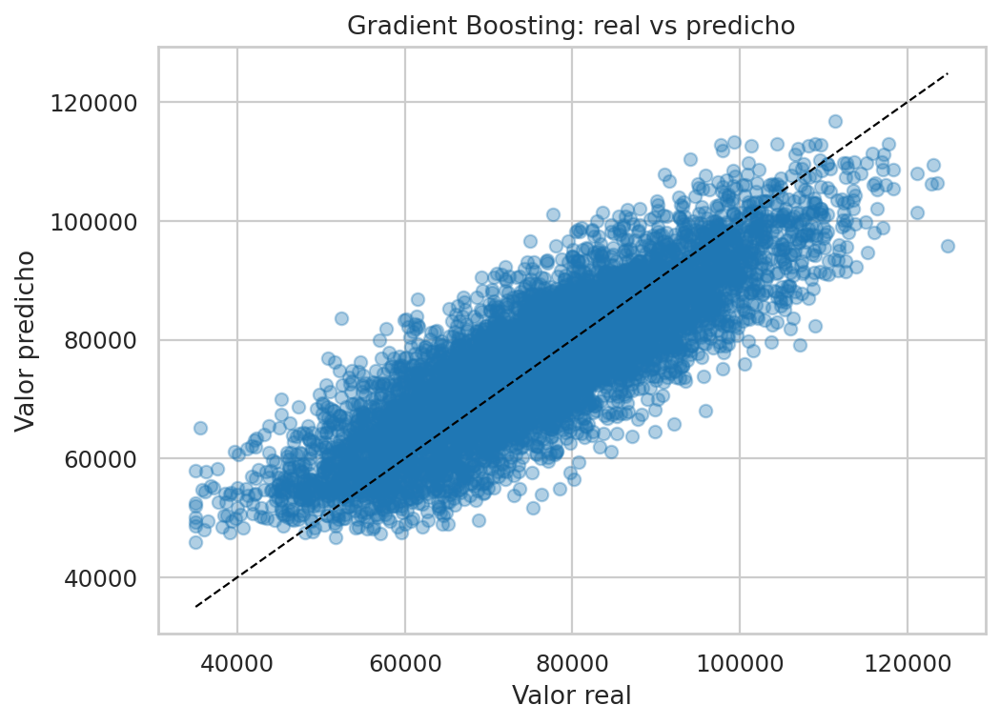
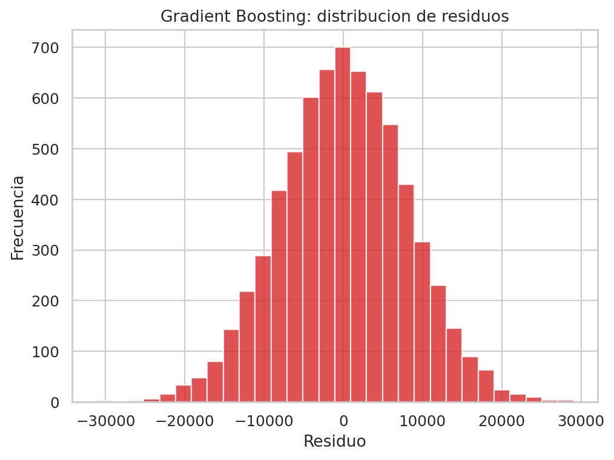
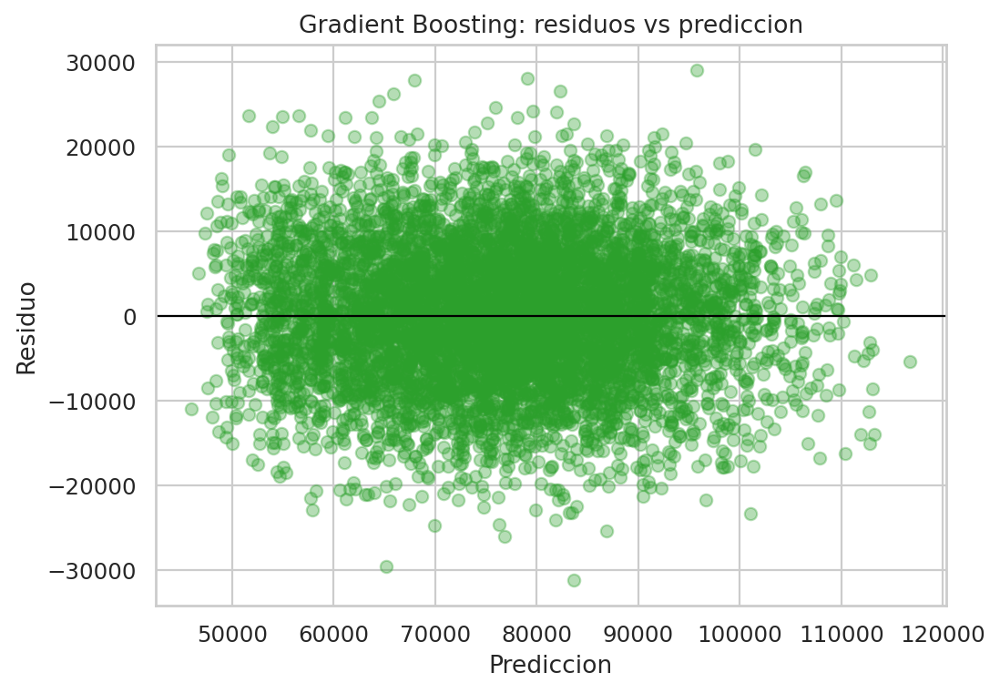
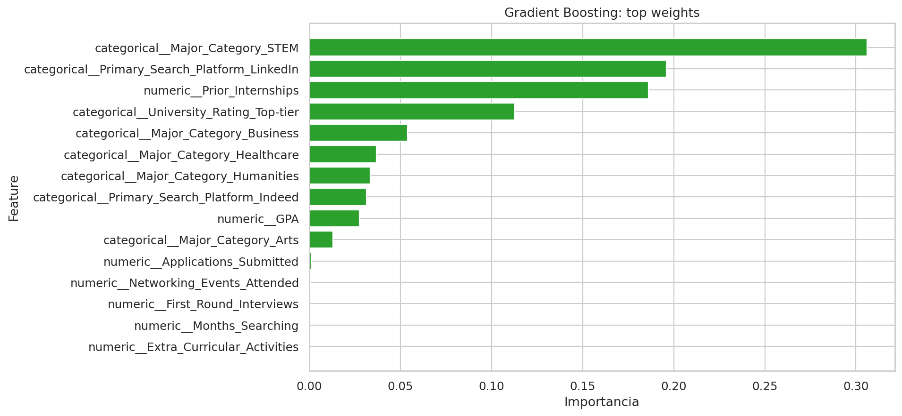

# Informe ejecutivo - Gradient Boosting

## 1. Resumen ejecutivo

Este informe presenta el desempeno del modelo **Gradient Boosting** para predecir `Offer_Salary` a partir de `dataset_offer_Salary.csv`.

### Resultado principal

- `MAE test`: 6349.8631
- `RMSE test`: 7951.8339
- `R2 test`: 0.7077
- `RMSE train`: 7981.4820
- `Brecha RMSE (test - train)`: -29.6482

**Lectura operativa:** La lectura por importancia permite identificar las variables que mas explican la variacion del salario dentro del modelo.

## 2. Archivos entregables

- Notebook principal: [regresion_offer_salary_completo.ipynb](../../../regresion_offer_salary_completo.ipynb)
- Modelo serializado: `gradient_boosting_offer_salary.pkl`
- Informe actual: `gradient_boosting_offer_salary.md`

## 3. Configuracion final del modelo

- `model__learning_rate`: `0.1`
- `model__max_depth`: `2`
- `model__n_estimators`: `200`
- `model__subsample`: `0.8`

## 4. Metricas de entrenamiento vs prueba

- **Train**: `MAE=6362.6054` | `RMSE=7981.4820` | `R2=0.7163`
- **Test**: `MAE=6349.8631` | `RMSE=7951.8339` | `R2=0.7077`

Interpretacion: una brecha train-test pequena sugiere mejor capacidad de generalizacion; una brecha amplia sugiere riesgo de sobreajuste.

## 5. Lectura ejecutiva de las graficas

### Real vs predicho



Si los puntos se acercan a la diagonal, el modelo predice salarios con mejor precision.

### Distribucion de residuos



Permite revisar si los errores se concentran cerca de cero o si hay colas con errores grandes.

### Residuos vs prediccion



Permite detectar patrones de sesgo: por ejemplo, si el modelo falla mas en rangos altos de salario.

### Variables mas influyentes



### Variables con mayor importancia

- `categorical__Major_Category_STEM`: `0.3060`
- `categorical__Primary_Search_Platform_LinkedIn`: `0.1960`
- `numeric__Prior_Internships`: `0.1862`
- `categorical__University_Rating_Top-tier`: `0.1127`
- `categorical__Major_Category_Business`: `0.0540`
- `categorical__Major_Category_Healthcare`: `0.0367`
- `categorical__Major_Category_Humanities`: `0.0334`
- `categorical__Primary_Search_Platform_Indeed`: `0.0315`
- `numeric__GPA`: `0.0274`
- `categorical__Major_Category_Arts`: `0.0131`


## 6. Uso del modelo serializado

```python
import pickle
from pathlib import Path
import pandas as pd

artifact_path = Path('gradient_boosting_offer_salary.pkl')
with open(artifact_path, 'rb') as f:
    artifact = pickle.load(f)

pipeline = artifact['pipeline']
feature_columns = artifact['feature_columns']

# Ejemplo: reemplazar por un registro real con las mismas columnas
nuevo = pd.DataFrame([{col: 0 for col in feature_columns}])
pred_salary = pipeline.predict(nuevo[feature_columns])[0]
print('Prediccion de salario:', round(float(pred_salary), 2))
```

## 7. Conclusion

El modelo **Gradient Boosting** queda disponible para uso operativo y comparacion tecnica frente a los otros algoritmos del notebook. Este informe deja trazabilidad completa de metricas, parametros, variables relevantes y artefactos.
