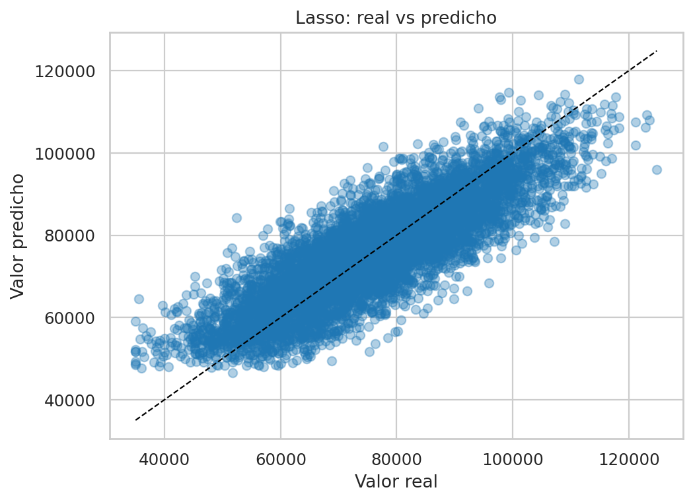
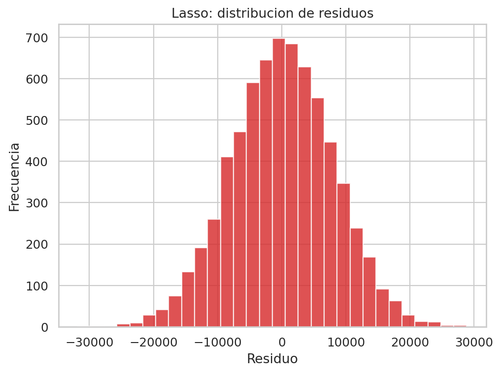
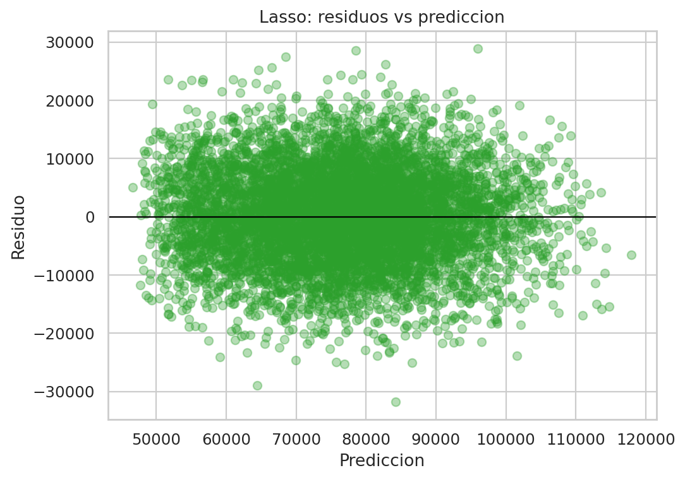
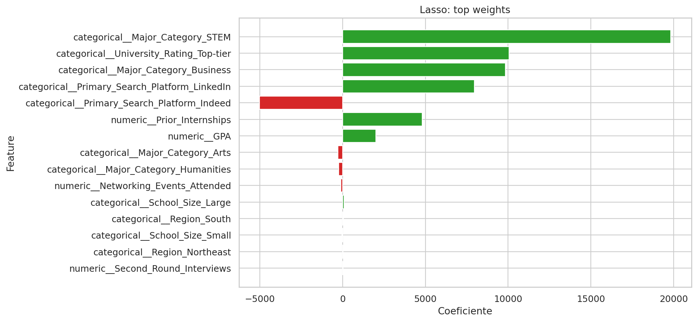

# Informe ejecutivo - Lasso para Offer_Salary

## 1. Resumen ejecutivo

Este informe documenta el modelo **Lasso** para predecir `Offer_Salary` a partir de `dataset_offer_Salary.csv`.

Lasso aplica regularizacion L1, lo que reduce la magnitud de coeficientes y favorece un modelo mas compacto. En este taller resulto ser el mejor modelo en la comparacion final.

### Resultado principal

- `MAE test`: 6339.7907
- `RMSE test`: 7941.9348
- `R2 test`: 0.7085
- `RMSE train`: 8014.7539
- `Brecha RMSE (test - train)`: -72.8191

**Lectura operativa:** Lasso no solo gana en error de prueba, sino que ademas conserva la interpretabilidad de la familia lineal. El resultado sugiere que la regularizacion L1 logro un mejor balance entre ajuste y simplicidad que la regresion lineal base y Ridge.

## 2. Archivos entregables

- Notebook principal: [regresion_offer_salary_completo.ipynb](../../../regresion_offer_salary_completo.ipynb)
- Modelo serializado: `lasso_offer_salary.pkl`
- Informe actual: `lasso_offer_salary.md`

## 3. Configuracion final del modelo

- `model__alpha`: `10`

## 4. Metricas de entrenamiento vs prueba

- **Train**: `MAE=6388.4189` | `RMSE=8014.7539` | `R2=0.7140`
- **Test**: `MAE=6339.7907` | `RMSE=7941.9348` | `R2=0.7085`

La brecha train-test es pequena y negativa, lo que indica que el modelo generaliza bien. En comparacion con la regresion lineal, Lasso mejora el `RMSE` de prueba en `2.6568` puntos, y frente a Ridge la mejora es de `2.6321` puntos. Aunque la diferencia es modesta, es consistente y suficiente para elegirlo como ganador tecnico.

## 5. Lectura ejecutiva de las graficas

### Real vs predicho



La nube de puntos se mantiene cerca de la diagonal ideal, lo que confirma que el modelo estima el salario con una relacion bastante estable respecto al valor real. La dispersion sigue existiendo, pero no se observan patrones graves que invaliden el ajuste.

### Distribucion de residuos



El histograma de residuos muestra errores repartidos alrededor de cero, con una forma coherente para un modelo bien calibrado. No hay un sesgo extremo visible; la mejora frente a otros modelos vino por una mejor regularizacion, no por una transformacion radical del error.

### Residuos vs prediccion



Este grafico ayuda a detectar si el modelo falla de forma diferente en rangos altos o bajos de salario. La lectura practica es que Lasso mantiene un comportamiento homogeneo, sin mostrar un patron sistematico fuerte de sobre o subprediccion.

### Variables mas influyentes



### Variables con mayor peso en el modelo

**Coeficientes positivos (empujan salario hacia arriba):**
- `categorical__Major_Category_STEM`: `19833.9501`
- `categorical__University_Rating_Top-tier`: `10066.6696`
- `categorical__Major_Category_Business`: `9833.9417`
- `categorical__Primary_Search_Platform_LinkedIn`: `7962.5759`
- `numeric__Prior_Internships`: `4809.1823`

**Coeficientes negativos (empujan salario hacia abajo):**
- `categorical__Primary_Search_Platform_Indeed`: `-5019.2704`
- `categorical__Major_Category_Arts`: `-292.5596`
- `categorical__Major_Category_Humanities`: `-240.9746`
- `numeric__Networking_Events_Attended`: `-114.1643`
- `categorical__School_Size_Small`: `-38.9119`

El resultado mas importante es que Lasso conserva el mismo relato general del problema, pero con una estructura mas parsimoniosa. Las senales mas fuertes siguen siendo coherentes: STEM, universidades top-tier, LinkedIn y experiencia previa empujan el salario hacia arriba; Indeed, Arts y Humanities lo empujan hacia abajo.


## 6. Uso del modelo serializado

```python
import pickle
from pathlib import Path
import pandas as pd

artifact_path = Path('lasso_offer_salary.pkl')
with open(artifact_path, 'rb') as f:
    artifact = pickle.load(f)

pipeline = artifact['pipeline']
feature_columns = artifact['feature_columns']

nuevo = pd.DataFrame([{col: 0 for col in feature_columns}])
pred_salary = pipeline.predict(nuevo[feature_columns])[0]
print('Prediccion de salario:', round(float(pred_salary), 2))
```

### Explicacion del uso

1. Se carga el pipeline guardado en pickle.
2. Se reutiliza el preprocesamiento exacto del entrenamiento.
3. Se construye un registro con las columnas esperadas.
4. Se obtiene la prediccion del salario de oferta.

## 7. Comparacion tecnica dentro del taller

Lasso quedo primero en la comparacion global porque logro el menor `RMSE_test` (`7941.9348`). Su ventaja sobre la regresion lineal y Ridge es pequena pero real; sobre Gradient Boosting tambien es favorable por `9.8991` puntos de RMSE. Frente a Random Forest y el arbol simple, la diferencia ya es considerable, por lo que los enfoques basados en arboles no compensaron su complejidad en este dataset.

## 8. Conclusion

El modelo **Lasso** es la mejor solucion final del taller. Su combinacion de regularizacion, simplicidad e interpretabilidad lo convierte en la opcion mas solida para reportar y para llevar a operacion.

La evidencia tecnica apunta a que el problema de `Offer_Salary` se beneficia mas de una estructura lineal regularizada que de modelos mas complejos. Lasso captura ese equilibrio con el menor error de prueba y una lectura clara de las variables relevantes.
