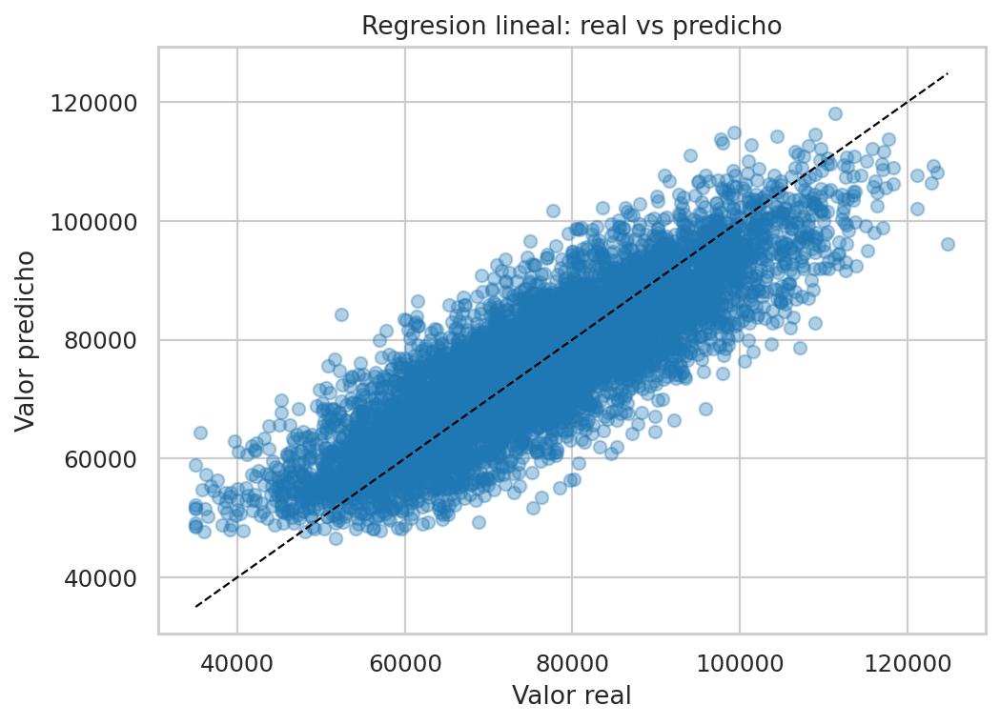
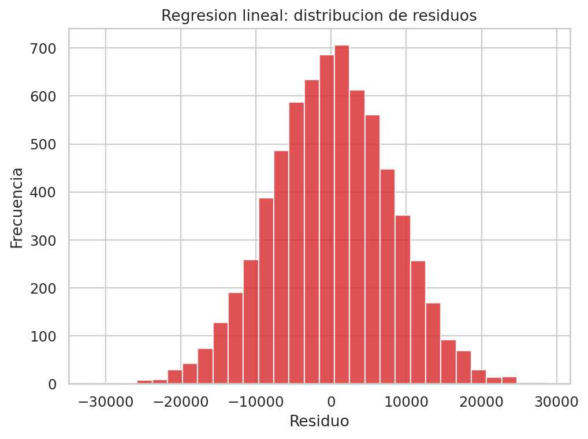
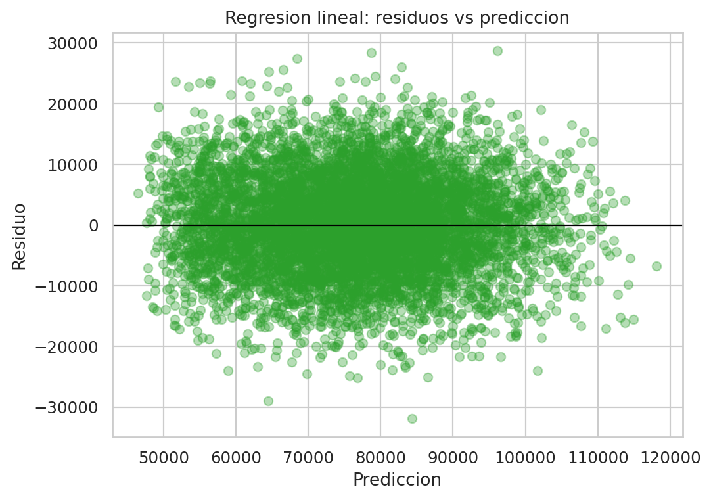
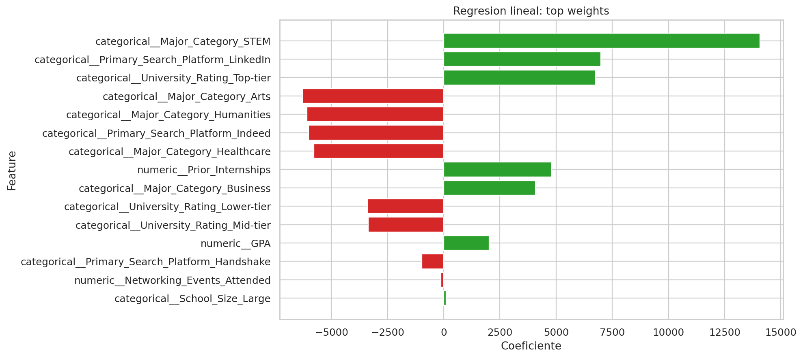

# Informe ejecutivo - Regresion lineal para Offer_Salary

## 1. Resumen ejecutivo

Este informe documenta la version base de regresion lineal usada para predecir `Offer_Salary` a partir de `dataset_offer_Salary.csv`.

La regresion lineal funciona como referencia tecnica porque ofrece una lectura directa de los coeficientes y permite comparar, con la misma base, la ganancia real de Ridge, Lasso y los modelos basados en arboles.

### Resultado principal

- `MAE test`: 6341.3362
- `RMSE test`: 7944.5915
- `R2 test`: 0.7083
- `RMSE train`: 8014.2402
- `Brecha RMSE (test - train)`: -69.6487

**Lectura operativa:** La familia lineal ya explica una parte importante de la variacion del salario. La regresion lineal no gana por complejidad, sino por estabilidad y legibilidad: su desempeno es muy cercano al mejor modelo del taller, lo que sugiere que el problema se aproxima bien con una estructura casi lineal tras el preprocesamiento.

## 2. Archivos entregables

- Notebook principal: [regresion_offer_salary_completo.ipynb](../../../regresion_offer_salary_completo.ipynb)
- Modelo serializado: `linear_regression_offer_salary.pkl`
- Informe actual: `linear_regression_offer_salary.md`

## 3. Configuracion final del modelo

- `fit_intercept`: `True`
- `positive`: `False`
- `n_jobs`: `None`

## 4. Metricas de entrenamiento vs prueba

- **Train**: `MAE=6388.0280` | `RMSE=8014.2402` | `R2=0.7140`
- **Test**: `MAE=6341.3362` | `RMSE=7944.5915` | `R2=0.7083`

La diferencia entre entrenamiento y prueba es pequena y favorable. En particular, el `RMSE` de prueba es incluso ligeramente menor que el de entrenamiento (`-69.6487`), lo que indica que el modelo no esta sobreajustado y que su capacidad de generalizacion es estable.

## 5. Lectura ejecutiva de las graficas

### Real vs predicho



La nube de puntos debe leerse respecto a la diagonal ideal. Cuando los casos se agrupan cerca de esa linea, la prediccion es mas precisa; cuando se separan, el modelo comete errores mas amplios. En este caso, el grafico sugiere una relacion bastante consistente entre valor real y valor estimado, aunque con dispersion visible en los extremos.

### Distribucion de residuos



La forma del histograma permite revisar si el error se concentra alrededor de cero o si existen colas largas. Aqui el patron es coherente con un modelo razonable: los residuos no muestran un sesgo extremo, pero si una variabilidad suficiente para recordar que no toda la complejidad del salario esta capturada por una forma lineal.

### Residuos vs prediccion



Este grafico sirve para detectar heterocedasticidad o sesgos sistematicos. La lectura util es que no aparece una curvatura marcada que invalide por completo la linealidad, aunque si se observa el comportamiento tipico de un problema tabular con ruido: algunos rangos de prediccion concentran errores mayores que otros.

### Variables mas influyentes



### Variables con mayor peso en el modelo

**Coeficientes positivos (empujan salario hacia arriba):**
- `categorical__Major_Category_STEM`: `14080.8433`
- `categorical__Primary_Search_Platform_LinkedIn`: `6999.1262`
- `categorical__University_Rating_Top-tier`: `6760.4091`
- `numeric__Prior_Internships`: `4811.7390`
- `categorical__Major_Category_Business`: `4082.1282`

**Coeficientes negativos (empujan salario hacia abajo):**
- `categorical__Major_Category_Arts`: `-6287.9000`
- `categorical__Major_Category_Humanities`: `-6092.3985`
- `categorical__Primary_Search_Platform_Indeed`: `-6027.2600`
- `categorical__Major_Category_Healthcare`: `-5782.6730`
- `categorical__University_Rating_Lower-tier`: `-3402.0021`

La lectura tecnica es clara: las variables asociadas a perfiles STEM, universidades top-tier, LinkedIn y practicas previas empujan la prediccion del salario hacia arriba. En cambio, areas como Arts, Humanities o el uso de Indeed aparecen asociadas con valores menores. Eso no debe interpretarse como causalidad, sino como una asociacion estadistica aprendida por el modelo.


## 6. Uso del modelo serializado

```python
import pickle
from pathlib import Path
import pandas as pd

artifact_path = Path('linear_regression_offer_salary.pkl')
with open(artifact_path, 'rb') as f:
    artifact = pickle.load(f)

pipeline = artifact['pipeline']
feature_columns = artifact['feature_columns']

nuevo = pd.DataFrame([{col: 0 for col in feature_columns}])
pred_salary = pipeline.predict(nuevo[feature_columns])[0]
print('Prediccion de salario:', round(float(pred_salary), 2))
```

### Explicacion del uso

1. Se carga el artefacto `.pkl`.
2. Se recupera el pipeline con el preprocesamiento ya embebido.
3. Se construye un DataFrame con las mismas columnas esperadas.
4. Se predice directamente el salario con `pipeline.predict()`.

## 7. Comparacion tecnica dentro del taller

La regresion lineal quedo muy cerca de Ridge, Lasso y Gradient Boosting. Sin embargo, fue superada por Lasso por un margen pequeno pero real (`2.6568` puntos de RMSE frente a Lasso). Eso significa que el modelo lineal base es una referencia solida, pero no la mejor opcion final.

## 8. Conclusion

El modelo **Regresion lineal** cumple bien como linea base del taller. Su desempeno es competitivo, su interpretacion es simple y su estabilidad en train y test es buena. La principal ventaja aqui no es que gane, sino que permite entender por que modelos mas regularizados como Lasso terminan siendo apenas mejores.

Como lectura final, este modelo deja una senal importante: el problema de `Offer_Salary` esta suficientemente estructurado como para que una forma lineal capturada sobre variables preprocesadas explique buena parte del comportamiento observado.
