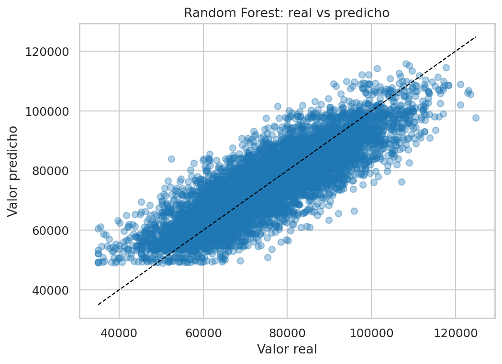
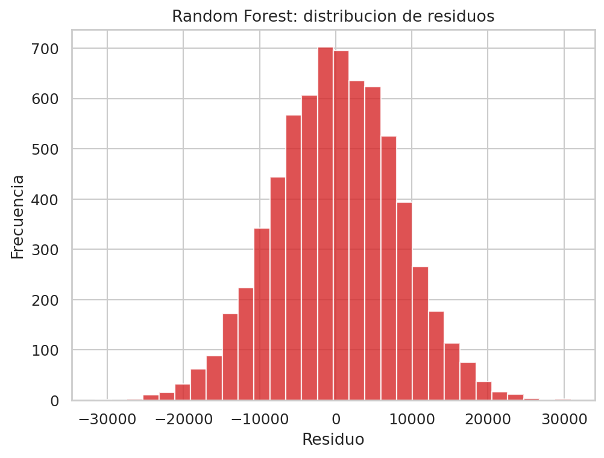
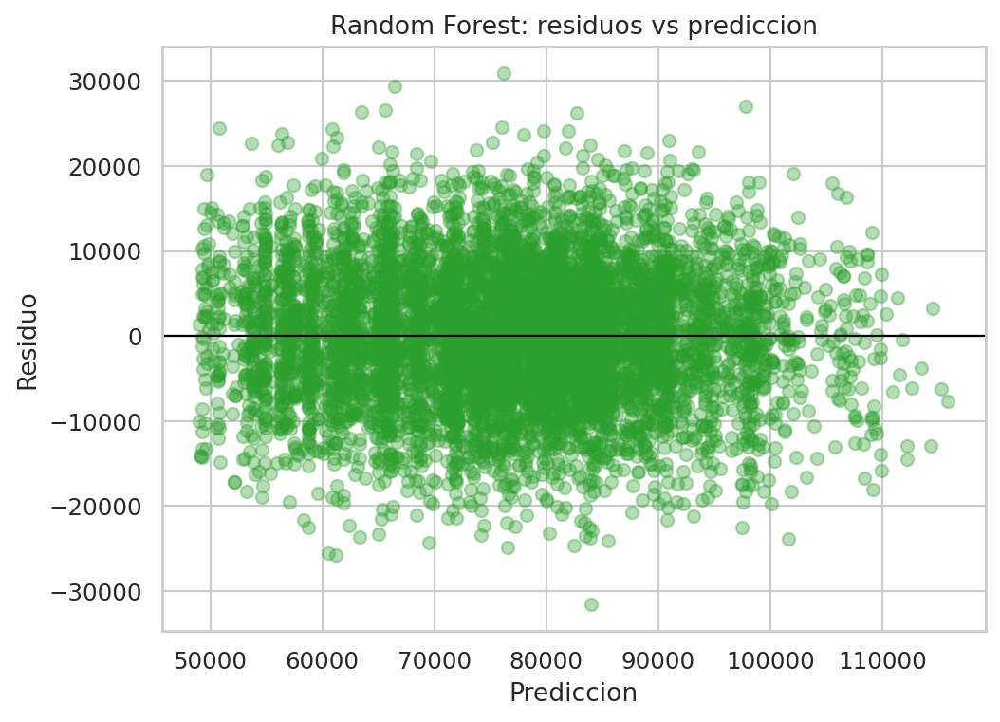
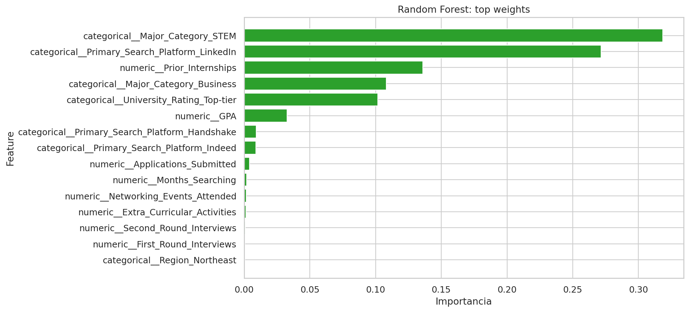

# Informe ejecutivo - Random Forest para Offer_Salary

## 1. Resumen ejecutivo

Este informe documenta el modelo **Random Forest** para predecir `Offer_Salary` a partir de `dataset_offer_Salary.csv`.

Random Forest mejora la estabilidad al promediar múltiples árboles, pero en este taller no logró superar a la familia lineal regularizada.

### Resultado principal

- `MAE test`: 6421.5444
- `RMSE test`: 8031.7346
- `R2 test`: 0.7018
- `RMSE train`: 7820.8640
- `Brecha RMSE (test - train)`: 210.8706

**Lectura operativa:** El ensamble mejora respecto al árbol único, pero la ganancia no alcanza para vencer a Lasso, Ridge o regresión lineal. El comportamiento muestra una brecha train-test moderada, señal de que el modelo aprende bien el entrenamiento pero generaliza peor que la mejor solución del taller.

## 2. Archivos entregables

- Notebook principal: [regresion_offer_salary_completo.ipynb](../../../regresion_offer_salary_completo.ipynb)
- Modelo serializado: `random_forest_offer_salary.pkl`
- Informe actual: `random_forest_offer_salary.md`

## 3. Configuracion final del modelo

- `model__max_depth`: `8`
- `model__min_samples_leaf`: `5`
- `model__n_estimators`: `400`

## 4. Metricas de entrenamiento vs prueba

- **Train**: `MAE=6233.9354` | `RMSE=7820.8640` | `R2=0.7276`
- **Test**: `MAE=6421.5444` | `RMSE=8031.7346` | `R2=0.7018`

La diferencia entre train y test es clara: el modelo ajusta bastante mejor el entrenamiento que los datos de prueba. Eso explica por qué, aunque Random Forest mejora frente al árbol individual, no logra el mismo equilibrio de generalización que Lasso.

## 5. Lectura ejecutiva de las graficas

### Real vs predicho



La dispersión es más amplia que la observada en los modelos lineales. El gráfico confirma que el ensamble sigue la tendencia general, pero comete errores mayores en varios rangos de salario.

### Distribucion de residuos



La distribución de residuos refleja una variabilidad todavía alta. Eso sugiere que el promedio de árboles sí amortigua parte del ruido, pero no consigue eliminar por completo la inestabilidad del ajuste.

### Residuos vs prediccion



Este gráfico ayuda a ver si el modelo se sesga en valores altos o bajos. La lectura general es que hay menos sesgo estructural que en un árbol simple, pero aún así el comportamiento queda por debajo de la familia lineal en consistencia global.

### Variables mas influyentes



### Variables con mayor importancia

- `categorical__Major_Category_STEM`: `0.3184`
- `categorical__Primary_Search_Platform_LinkedIn`: `0.2716`
- `numeric__Prior_Internships`: `0.1360`
- `categorical__Major_Category_Business`: `0.1082`
- `categorical__University_Rating_Top-tier`: `0.1018`
- `numeric__GPA`: `0.0326`
- `categorical__Primary_Search_Platform_Handshake`: `0.0092`
- `categorical__Primary_Search_Platform_Indeed`: `0.0089`
- `numeric__Applications_Submitted`: `0.0042`
- `numeric__Months_Searching`: `0.0018`

La importancia de variables es coherente con el resto del taller: STEM, LinkedIn, experiencia previa y universidad top-tier dominan la señal. Sin embargo, esa coherencia semántica no compensa el peor error de prueba frente a Lasso.


## 6. Uso del modelo serializado

```python
import pickle
from pathlib import Path
import pandas as pd

artifact_path = Path('random_forest_offer_salary.pkl')
with open(artifact_path, 'rb') as f:
    artifact = pickle.load(f)

pipeline = artifact['pipeline']
feature_columns = artifact['feature_columns']

nuevo = pd.DataFrame([{col: 0 for col in feature_columns}])
pred_salary = pipeline.predict(nuevo[feature_columns])[0]
print('Prediccion de salario:', round(float(pred_salary), 2))
```

### Explicación del uso

1. Se carga el modelo en pickle.
2. Se reutiliza el preprocesamiento incorporado.
3. Se arma la matriz con columnas esperadas.
4. Se obtiene el valor de salario predicho.

## 7. Comparación técnica dentro del taller

Random Forest quedo por detras de la familia lineal y tambien por detras de Gradient Boosting. La diferencia frente a Lasso fue de `89.7998` puntos de RMSE, una brecha suficientemente grande como para descartarlo como mejor alternativa final del taller.

## 8. Conclusion

El modelo **Random Forest** es util como referencia no lineal robusta, pero en este problema no ofrece una mejora suficiente para competir con la solucion lineal regularizada. Su mayor fortaleza esta en la estabilidad relativa frente a un arbol unico; su limitacion, en cambio, es que no logra superar el error de prueba del mejor modelo.

Para este dataset, Random Forest sirve como contraste metodologico, no como recomendacion final.
