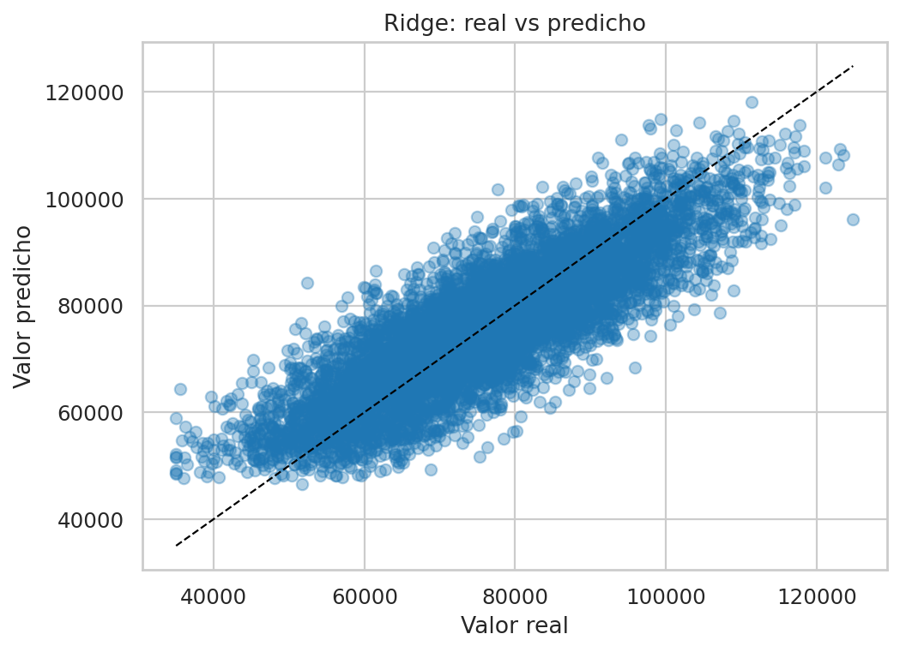
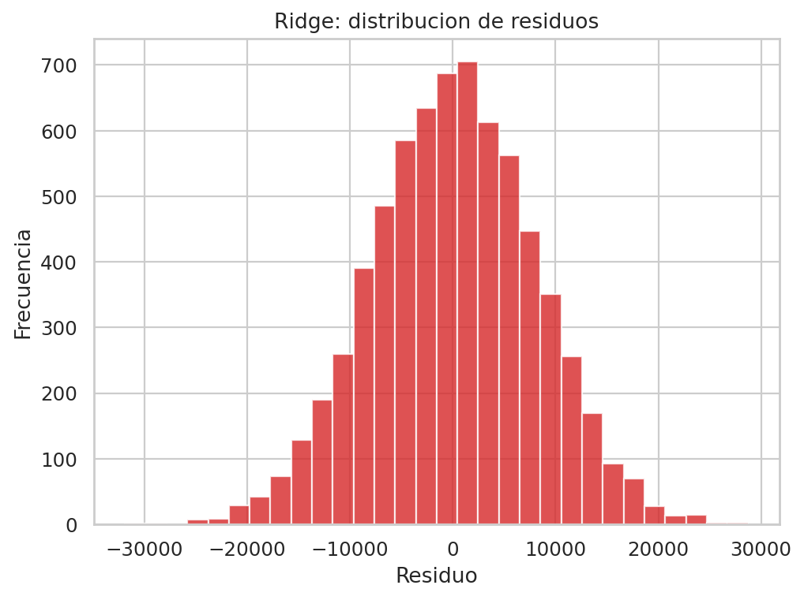
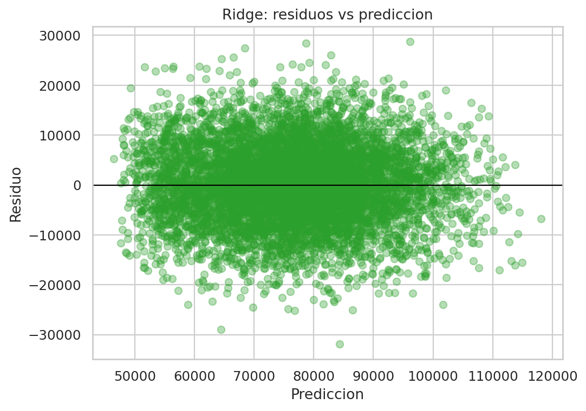
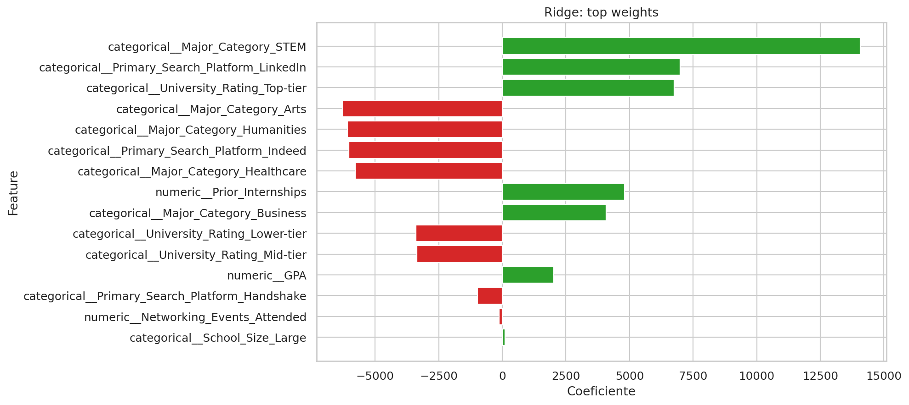

# Informe ejecutivo - Ridge

## 1. Resumen ejecutivo

Este informe presenta el desempeno del modelo **Ridge** para predecir `Offer_Salary` a partir de `dataset_offer_Salary.csv`.

### Resultado principal

- `MAE test`: 6341.3403
- `RMSE test`: 7944.5669
- `R2 test`: 0.7083
- `RMSE train`: 8014.2404
- `Brecha RMSE (test - train)`: -69.6736

**Lectura operativa:** La lectura por coeficientes facilita explicar la direccion de cada variable sobre el salario predicho, sin interpretar causalidad.

## 2. Archivos entregables

- Notebook principal: [regresion_offer_salary_completo.ipynb](../../../regresion_offer_salary_completo.ipynb)
- Modelo serializado: `ridge_offer_salary.pkl`
- Informe actual: `ridge_offer_salary.md`

## 3. Configuracion final del modelo

- `model__alpha`: `1`

## 4. Metricas de entrenamiento vs prueba

- **Train**: `MAE=6388.0345` | `RMSE=8014.2404` | `R2=0.7140`
- **Test**: `MAE=6341.3403` | `RMSE=7944.5669` | `R2=0.7083`

Interpretacion: una brecha train-test pequena sugiere mejor capacidad de generalizacion; una brecha amplia sugiere riesgo de sobreajuste.

## 5. Lectura ejecutiva de las graficas

### Real vs predicho



Si los puntos se acercan a la diagonal, el modelo predice salarios con mejor precision.

### Distribucion de residuos



Permite revisar si los errores se concentran cerca de cero o si hay colas con errores grandes.

### Residuos vs prediccion



Permite detectar patrones de sesgo: por ejemplo, si el modelo falla mas en rangos altos de salario.

### Variables mas influyentes



### Variables con mayor peso en el modelo

**Coeficientes positivos (empujan salario hacia arriba):**
- `categorical__Major_Category_STEM`: `14078.1763`
- `categorical__Primary_Search_Platform_LinkedIn`: `6998.4645`
- `categorical__University_Rating_Top-tier`: `6759.3360`
- `numeric__Prior_Internships`: `4811.7946`
- `categorical__Major_Category_Business`: `4080.5187`

**Coeficientes negativos (empujan salario hacia abajo):**
- `categorical__Major_Category_Arts`: `-6284.2062`
- `categorical__Major_Category_Humanities`: `-6092.0637`
- `categorical__Primary_Search_Platform_Indeed`: `-6026.0911`
- `categorical__Major_Category_Healthcare`: `-5782.4251`
- `categorical__University_Rating_Lower-tier`: `-3401.4081`


## 6. Uso del modelo serializado

```python
import pickle
from pathlib import Path
import pandas as pd

artifact_path = Path('ridge_offer_salary.pkl')
with open(artifact_path, 'rb') as f:
    artifact = pickle.load(f)

pipeline = artifact['pipeline']
feature_columns = artifact['feature_columns']

# Ejemplo: reemplazar por un registro real con las mismas columnas
nuevo = pd.DataFrame([{col: 0 for col in feature_columns}])
pred_salary = pipeline.predict(nuevo[feature_columns])[0]
print('Prediccion de salario:', round(float(pred_salary), 2))
```

## 7. Conclusion

El modelo **Ridge** queda disponible para uso operativo y comparacion tecnica frente a los otros algoritmos del notebook. Este informe deja trazabilidad completa de metricas, parametros, variables relevantes y artefactos.
