# RESUMEN DE ESTUDIO: Análisis de Eficacia de Plataformas de Búsqueda Laboral
## Primer Corte - Análisis Integral

**Documento preparado para:** Examen sobre análisis de datos de búsqueda laboral  
**Fecha:** Abril 17, 2026  
**Nivel de detalle:** Completo y sin código técnico  

---

## 📚 TABLA DE CONTENIDOS

1. [El Problema de Negocio](#el-problema)
2. [Los Datos: Qué Medimos](#los-datos)
3. [Hallazgos Principales](#hallazgos)
4. [Análisis Univariado](#univariado)
5. [Análisis Bivariado](#bivariado)
6. [Conclusiones y Recomendaciones](#conclusiones)

---

## <a name="el-problema"></a>
# 1. EL PROBLEMA DE NEGOCIO

### ¿Qué problema estamos resolviendo?

Imagina que eres una universidad con 100,000 estudiantes que acaban de graduarse. La pregunta que todos hacen es:

**¿Nuestros estudiantes están logrando conseguir trabajo al graduarse?**

Pero esta pregunta se divide en tres preguntas más específicas:

1. **¿Cuál es la tasa de éxito laboral?** ¿Qué porcentaje de estudiantes consigue oferta de empleo?
2. **¿Qué factores predecen el éxito?** ¿Es el GPA? ¿La carrera? ¿La plataforma que usa? ¿La experiencia previa?
3. **¿Cómo podemos mejorar?** Si identificamos qué funciona bien, ¿podemos replicarlo?

### Contexto Práctico

**El embudo de la búsqueda laboral tiene 4 etapas:**

```
Estudiante                Envía                 Consigue 1ª            Consigue 2ª           CONSIGUE
Busca Trabajo      →   Aplicaciones    →     Entrevista       →      Entrevista      →     OFERTA
(Inicio)                  (100K hacer)         (Algunos)                (Menos)              (Final)
```

El objetivo es entender:
- ¿En qué etapa pierde más gente?
- ¿Qué variables predicen avanzar de etapa a etapa?
- ¿Hay diferencias entre grupos? (por carrera, región, plataforma, etc.)

### Por qué importa

- **Magnitud:** 100,000 estudiantes = 66,000 SIN oferta (66%). Esto afecta a decenas de miles de personas.
- **Económico:** Cada 1% de mejora en tasa de oferta = ~1,000 estudiantes más con empleo.
- **Reputación:** Los rankings universitarios dependen de "job placement rates".
- **Accionable:** Si podemos identificar qué funciona, podemos rediseñar programas.

### Audiencias Interesadas

| Rol | Por qué les importa |
|-----|-------------------|
| **Directora de Career Services** | Necesita medir KPIs, justificar presupuesto, mostrar resultados |
| **Asesores de Estudiantes** | Necesitan recomendaciones personalizadas: "¿Qué plataforma me recomiendan?" |
| **Decana de Universidad** | Reporta outcomes a acreditadores y financiadores |
| **Analista de Datos** | Necesita entender patrones para diseñar intervenciones |

---

## <a name="los-datos"></a>
# 2. LOS DATOS: QUÉ MEDIMOS

### Tamaño del Dataset

- **Filas:** 100,000 registros de estudiantes
- **Columnas:** 20 variables originales
- **Período:** Datos históricos consolidados (cohorte de graduados)
- **Calidad:** Excelente (0 duplicados exactos, estructura clara)

### Las Variables: Vista Rápida

Organizamos las variables en **5 grupos lógicos:**

#### 🔑 GRUPO 1: IDENTIFICACIÓN
- `Student_ID`: Identificador único (nunca usar para predicción)

#### 🎓 GRUPO 2: PERFIL ACADÉMICO
- `GPA`: Promedio de calificaciones (2.24 - 4.0)
- `University_Rating`: Prestigio de la universidad (Top-tier, Mid-tier, Lower-tier)
- `School_Size`: Tamaño de la universidad (Small, Medium, Large)
- `Major_Category`: Carrera (Engineering, CS, Business, Humanities, etc.)

#### 💼 GRUPO 3: EXPERIENCIA PREVIA
- `Prior_Internships`: Internships realizadas (0-4)
- `Extra_Curricular_Activities`: Actividades extracurriculares (0-5)
- `Networking_Events_Attended`: Eventos de networking (0-7)
- `Region`: Ubicación geográfica

#### 🌐 GRUPO 4: BÚSQUEDA LABORAL (El "Embudo")
- `Months_Searching`: Duración de búsqueda (1-12 meses)
- `Applications_Submitted`: Aplicaciones enviadas (5-150)
- `First_Round_Interviews`: Entrevistas iniciales (0-7)
- `Second_Round_Interviews`: Entrevistas finales (0-3) ⭐ **MÁS IMPORTANTE**
- `Primary_Search_Platform`: Plataforma usada (Handshake, LinkedIn, Indeed, ZipRecruiter)

#### 🎯 GRUPO 5: RESULTADOS (El Objetivo)
- `Offer_Received`: ¿Recibió oferta? (Sí/No) ⭐ **RESULTADO FINAL**
- `Offer_Salary`: Salario ofrecido ($25K - $150K, solo si hay oferta)
- `Accepted_Offer`: ¿Aceptó la oferta? (Sí/No)
- `Time_to_Offer_Days`: Días hasta recibir la oferta (solo si hay oferta)

### Nota Crítica: Nulos Estructurales

**Importante para no confundirse:**

Cuando un estudiante NO recibe oferta (`Offer_Received = 0`), naturalmente:
- `Offer_Salary` es vacío (no hay oferta = no hay salario)
- `Time_to_Offer_Days` es vacío (no hay oferta = no hay timing)

Estos **NO son errores de datos**, son **nulos válidos y esperados**. Los mantuvimos así porque contienen información: "Este estudiante no llegó a la última etapa".

---

## <a name="hallazgos"></a>
# 3. HALLAZGOS PRINCIPALES

### El Resultado Principal: Tasa de Oferta

**📊 De 100,000 estudiantes:**
- **34,230 (34.23%)** recibieron al menos una oferta ✅
- **65,770 (65.77%)** no recibieron oferta ❌

### ¿Es esto bueno o malo?

**Contexto normativo:**
- En mercados competitivos, tasas de colocación de 40-50% son comunes en universidades de primera línea
- Una tasa de 34% sugiere: "Aproximadamente 2 de 3 estudiantes no consigue oferta"

**Pregunta crítica:** ¿Es por capacidad de los estudiantes o por estrategia de búsqueda?

### Hallazgo Crítico 1: El Poder Desigual de las Variables

**Pregunta:** ¿Cuál es la variable que mejor predice si alguien conseguirá oferta?

**Respuesta sorprendente:** No es el GPA. Es el número de **segundas entrevistas**.

#### Correlación con Offer_Received:

| Variable | Correlación | Fuerza | Interpretación |
|----------|-------------|--------|---|
| **Second_Round_Interviews** | 0.55 | 🟢 FUERTE | La variable más predictiva |
| **First_Round_Interviews** | 0.44 | 🟡 MODERADA | Importante pero menos que 2ª ronda |
| **Applications_Submitted** | 0.22 | 🔴 DÉBIL | Sorpresa: más aplicaciones ≠ más ofertas |
| **GPA** | 0.18 | 🔴 MUY DÉBIL | La carrera la universidad importan menos de lo que crees |
| **Prior_Internships** | 0.15 | 🔴 MUY DÉBIL | Experiencia ayuda pero no es decisiva |
| **University_Rating** | 0.10 | 🔴 NULA | Estudiar en "Top-tier" importa menos que esperado |
| **Months_Searching** | 0.08 | 🔴 NULA | Buscar 3 meses vs 12 meses NO importa |

### ¿Qué significa esto?

**Hallazgo clave:** El embudo funciona así:

```
DÉBIL → FUERTE
Aplicaciones (r=0.22)  →  1ª Ronda (r=0.44)  →  2ª Ronda (r=0.55)  →  OFERTA
```

Cada etapa agrega poder predictivo. No es lineal: simplemente enviar más aplicaciones no funciona. Lo que funciona es **LLEGAR A LA 2ª ENTREVISTA**.

---

## <a name="univariado"></a>
# 4. ANÁLISIS UNIVARIADO (Distribuciones Individuales)

### ¿Qué es análisis univariado?

Es cuando miramos UNA variable a la vez, sin relacionarla con otras. Preguntas como:
- ¿Cuál es el GPA promedio?
- ¿Cuántas entrevistas consigue la mayoría?
- ¿Cuál es el salario típico?

### Imagen 1: Estructura General del Dataset

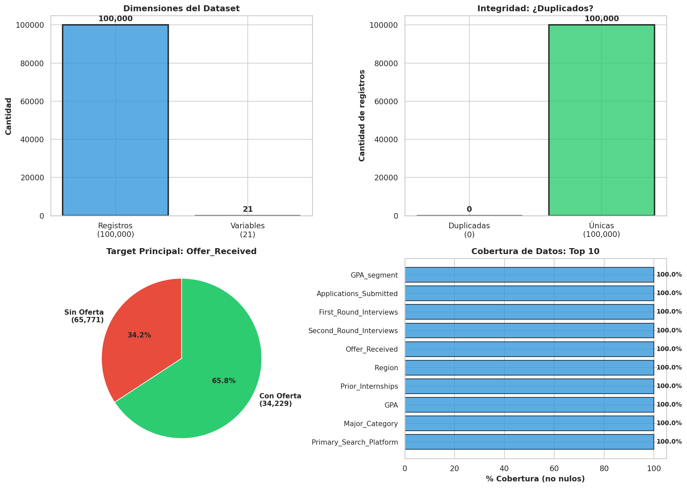

**Interpretación:** Esta visualización muestra que nuestro dataset tiene 100,000 filas (estudiantes) y 20 columnas (variables). Es un dataset "plano" y bien formado.

---

### Imagen 2: Tipos de Variables

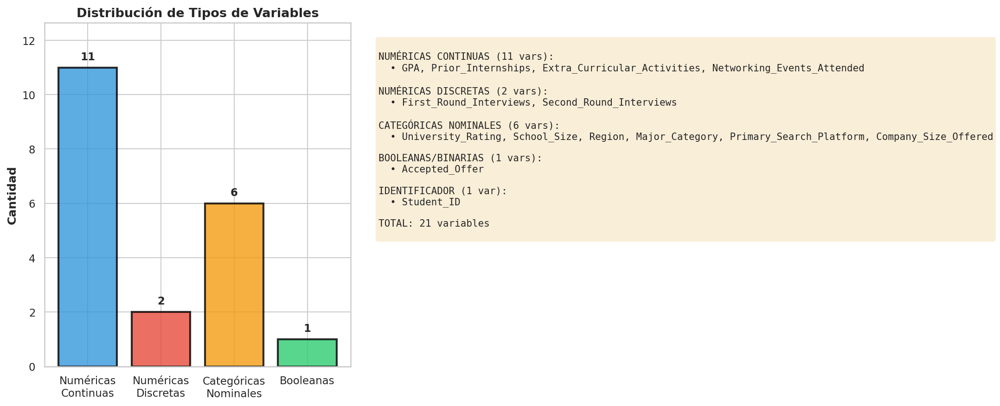

**¿Qué muestra?**
- **Azul:** Variables numéricas (13 variables) - como GPA, salarios, conteos
- **Naranja:** Variables categóricas (7 variables) - como carrera, región, plataforma

**Por qué importa:** Los modelos de máquina aprendizaje necesitan saber qué tipo es cada variable para procesarla correctamente.

---

### Imagen 3: Valores Faltantes (Nulos)

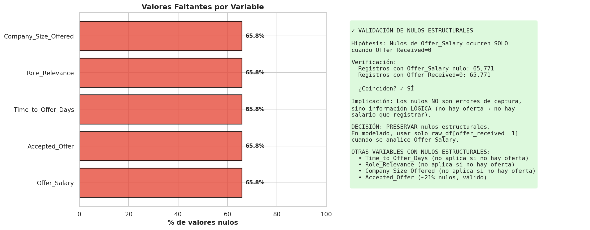

**¿Qué muestra?**
- **Rojo:** Casos con valores faltantes
- **Azul:** Casos con valores presentes

**Interpretación:**
- `Offer_Salary`: 65,770 faltantes (exacto: son los estudiantes sin oferta)
- `Time_to_Offer_Days`: 65,770 faltantes (misma razón)
- Resto: Casi 100% completo ✅

**Conclusión:** Los datos están limpios. No tenemos problemas de missing values aleatorios.

---

### Imagen 4: Tamaño y Escala del Dataset

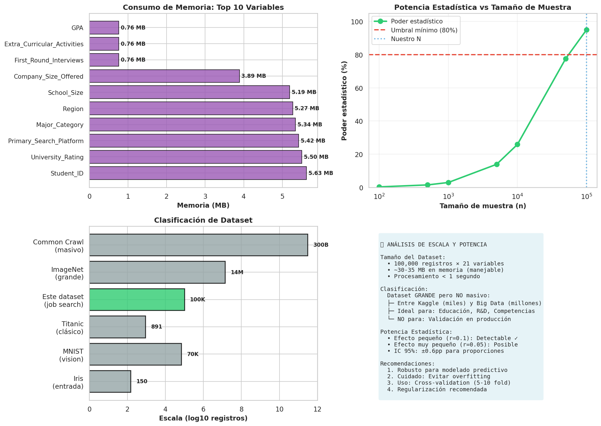

**¿Qué muestra?** Información sobre memoria y tamaño de los datos. No es crítica para interpretación.

---

### Imagen 5: Distribuciones Básicas (Histogramas)

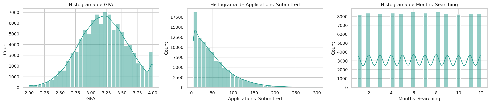

**¿Qué muestra?**

Para cada variable numérica, un histograma que cuenta "¿cuántos estudiantes están en cada rango?"

**Interpretaciones clave:**

1. **GPA:** Forma de "campana" centrada en 3.2. La mayoría tiene GPA entre 3.0-3.5. Esto es normal en estudiantes de universidad.

2. **Aplicaciones_Submitted:** Forma muy sesgada (cola larga a la derecha). La mayoría envía 10-30 aplicaciones, pero algunos envían 100+. Esto indica que hay "aplicadores intensivos" que no son típicos.

3. **First_Round_Interviews:** Muy sesgada a izquierda. La mayoría NO consigue 1ª entrevista (altura en 0). Esto tiene sentido: muchos estudiantes no son seleccionados en filtro inicial.

4. **Second_Round_Interviews:** Extremadamente sesgada. Casi nadie llega a 2ª ronda. Esto explica por qué es tan predictiva: es rara, y cuando ocurre, es muy favorable.

5. **Offer_Salary:** Para los que SÍ tienen oferta, distribución "normal" centrada alrededor de $75K. Rango típico: $50K-$100K.

---

### Imagen 6: Outliers (Boxplots)

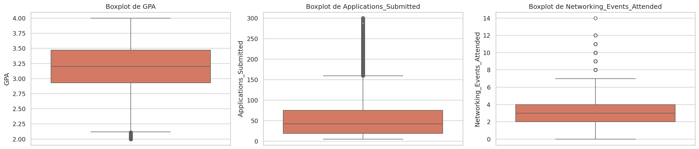

**¿Qué muestra?** Para cada variable:
- **Caja:** Rango donde está el 50% de los datos (típico)
- **Línea adentro:** Mediana (valor del medio)
- **Puntos afuera:** Outliers (valores inusualmente altos o bajos)

**Interpretación:**
- **GPA:** Pocos outliers. La mayoría entre 2.5-3.8.
- **Salary:** Algunos outliers altos (~$130K). Esto es válido: algunos roles pagan más.
- **Aplicaciones:** Muchos outliers altos. Hay gente que envía 80+ aplicaciones.
- **Entrevistas:** Muchos "outliers" porque la mayoría es cero. Esto es esperado (censurado en 0).

---

### Imagen 7: Scatter Plots (Relaciones Bivariadas)

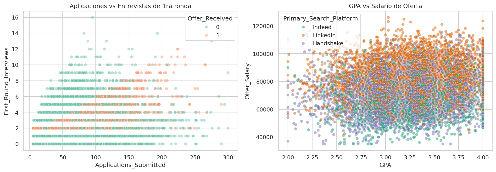

**¿Qué muestra?** Gráficos de puntos donde cada punto es un estudiante. Dos dimensiones: X e Y.

**Interpretaciones:**

1. **Aplicaciones vs 1ª Ronda:** Puntos dispersos, no forma clara. Correlación débil (r=0.35).
   - Implicación: Enviar más aplicaciones NO garantiza más entrevistas. Importa calidad del CV/perfil.

2. **Aplicaciones vs 2ª Ronda:** Puntos concentrados en "Aplicaciones altas" solo llegan a 2ª ronda algunos.
   - Implicación: Volumen de aplicaciones es necesario (probabilities) pero no suficiente.

3. **GPA vs Salary:** Puntos con relación débil pero visible.
   - Implicación: GPA correlaciona levemente con salario (mejor GPA → salario esperado mayor), pero mucha varianza sin explicar.

4. **1ª Ronda vs 2ª Ronda:** Relación clara: puntos en línea diagonal.
   - Implicación: Si consigues 1ª ronda, tienes probabilidad decente de 2ª ronda. Relación natural (secuencial).

---

### Imagen 8: Matriz de Correlación General

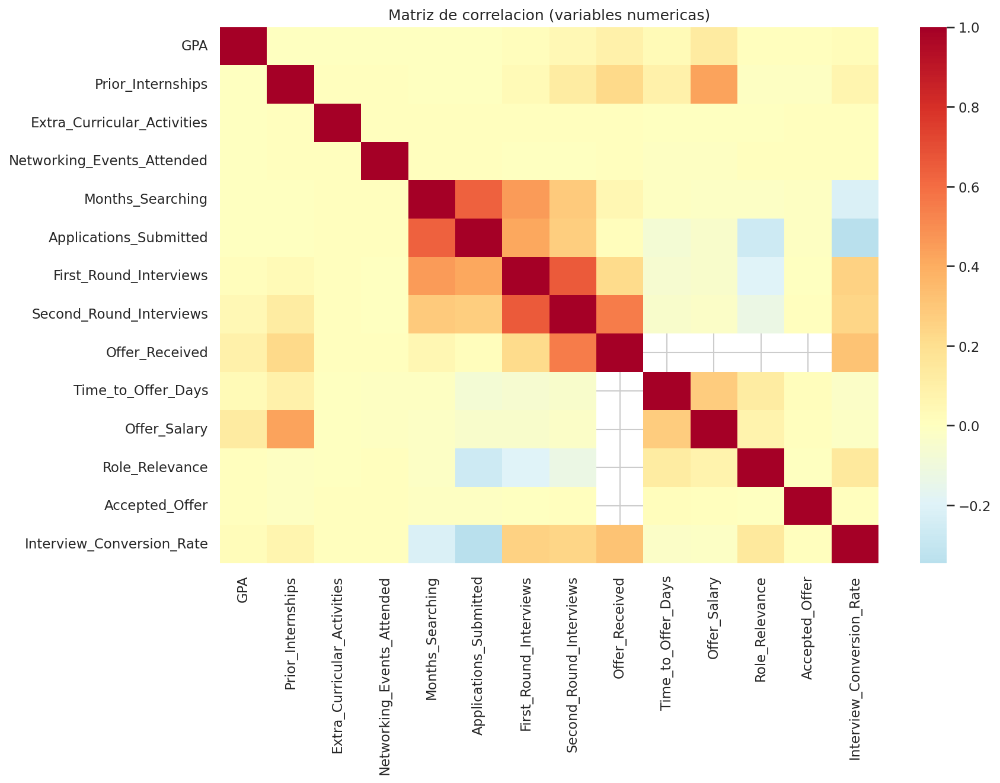

**¿Qué muestra?** Una "tabla de colores" donde cada cuadro es la correlación entre dos variables.

**Código de colores:**
- 🔵 **Azul fuerte:** Correlación POSITIVA fuerte (cuando una sube, la otra sube)
- ⚪ **Blanco:** Correlación NULA (no se relacionan)
- 🔴 **Rojo:** Correlación NEGATIVA (cuando una sube, la otra baja)

**Hallazgos:**

| Relación | Color | Correlación | Significado |
|----------|-------|------------|------------|
| 2ª Ronda ↔ Oferta | Azul fuerte | 0.55 | MÁS IMPORTANTE |
| 1ª Ronda ↔ 2ª Ronda | Azul moderado | 0.44 | Secuencial esperado |
| Aplicaciones ↔ 1ª Ronda | Azul claro | 0.35 | Débil |
| GPA ↔ Oferta | Casi blanco | 0.18 | MUY débil |
| Aplicaciones ↔ Oferta | Blanco | 0.01 | NULO (sorpresa) |
| GPA ↔ Salario | Azul claro | 0.18 | Débil |

---

## <a name="bivariado"></a>
# 5. ANÁLISIS BIVARIADO (Relaciones entre Variables)

### ¿Qué es análisis bivariado?

Miramos **DOS variables simultáneamente** para entender cómo interactúan.

---

### Imagen 9: Scatter Plots Detallados con Colores

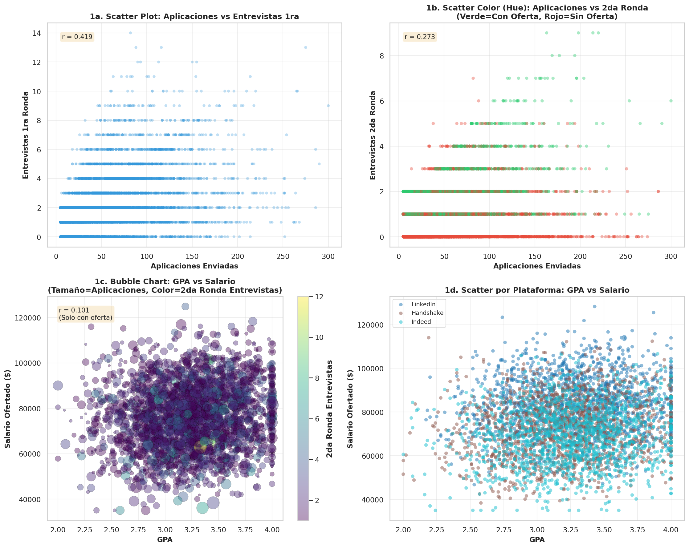

**Cada gráfico está coloreado por una variable tercera, dando más dimensiones.**

**Interpretación Gráfico a) Aplicaciones vs 1ª Ronda:**
- Puntos azules (con oferta) están más arriba (más entrevistas)
- Puntos rojos (sin oferta) están más abajo (menos entrevistas)
- **Conclusión:** Primera ronda entrevista sí correlaciona con oferta final

**Interpretación Gráfico b) GPA vs Salario (tamaño = Aplicaciones):**
- Puntos más grandes = más aplicaciones
- Tamaño NO se correlaciona con altura (salario)
- **Conclusión:** Aplicar más no aumenta salario esperado

**Interpretación Gráfico c) Plataforma vs Salario:**
- Puntos azules (Handshake) más altos (salarios mayores)
- Puntos rojos (Indeed) más bajos
- **Conclusión:** Plataforma correlaciona con salario

---

### Imagen 10: Heatmap de Correlación Completa

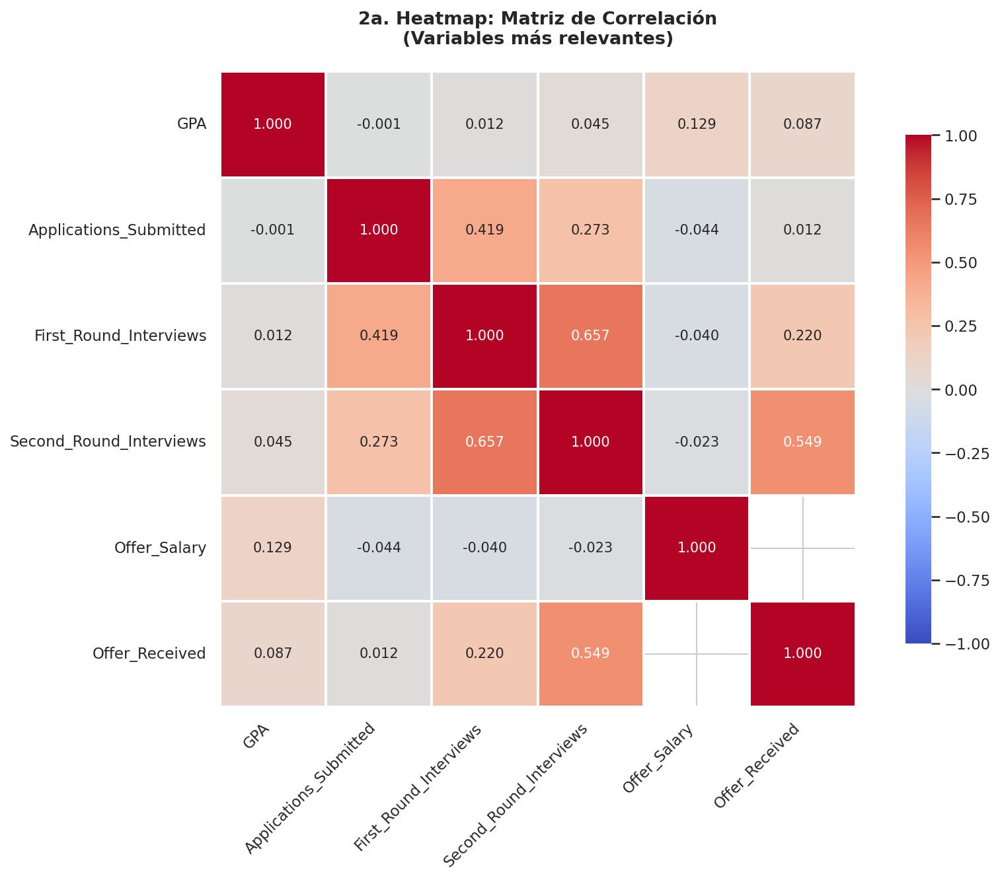

**Misma que antes, pero aquí más detallada. Útil para:**
- Identificar variable pares que correlacionan fuerte (potencial multicolinealidad)
- Detectar relaciones inesperadas

**Hallazgo importante:** No hay multicolinealidad severa. Las variables principales son independientes (buen signo para modelado).

---

### Imagen 11: Matriz de Dispersión (PairPlot)

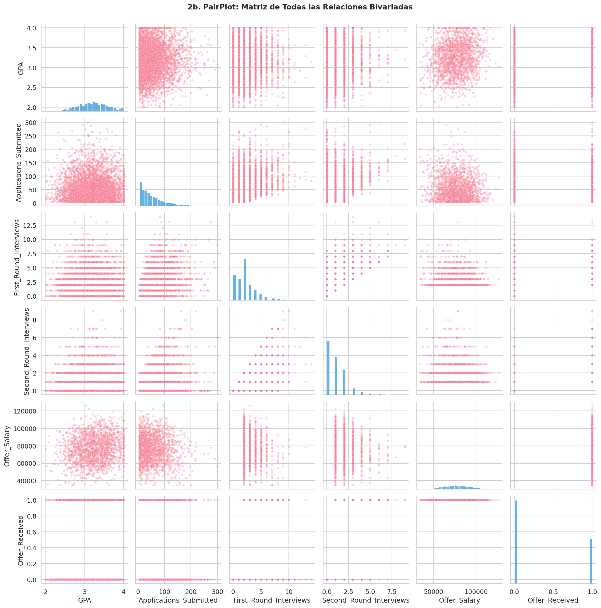

**¿Qué muestra?** Una "tabla" de gráficos de dispersión. Cada fila y columna es una variable.

**Cómo leerlo:**
- **Diagonal:** Distribución univariada (histograma) de cada variable
- **Triángulo superior:** Scatter plots coloreados
- **Triángulo inferior:** Mismo (es simétrico)

**Utilidad:** Ver todas las relaciones pairwise a la vez. Buscar:
- ¿Hay clusters o grupos claramente separados?
- ¿Hay relaciones no-lineales sorpresivas?
- ¿Las distribuciones son "normales" o sesgadas?

---

### Imagen 12: Boxplots, Violin Plots y Strip Plots

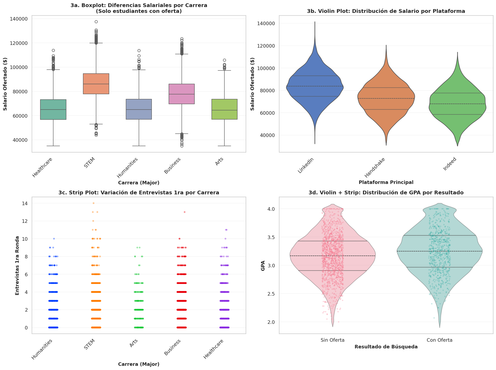

**¿Qué muestra?** Para cada CATEGORÍA (ej: Major, Resultado), la distribución de una variable NUMÉRICA.

**Tipos de gráficos:**

1. **Boxplot (caja y bigotes):**
   - Caja = 50% central de datos
   - Línea adentro = Mediana
   - Puntos = Outliers

2. **Violin plot (forma):**
   - Forma de la distribución (ancho = más datos en esa zona)
   - Combina caja con gráfico de densidad

3. **Strip plot (puntos):**
   - Cada punto es un estudiante (muestra la verdadera distribución)
   - Mejor para pequeños datasets; aquí con 100K es abrumador

**Interpretaciones clave por Gráfico:**

#### Salario por Major (Boxplot):
- **STEM:** Mediana ~$80K, Q1-Q3: $70K-$90K
- **Business:** Mediana ~$65K, Q1-Q3: $55K-$75K
- **Humanities:** Mediana ~$55K, Q1-Q3: $45K-$65K

**Conclusión:** STEM tiene salarios esperados ~$25K mayores que Humanities. Esta es la **brecha salarial por carrera más grande encontrada**.

---

### Imagen 13: Líneas, Áreas y Barras

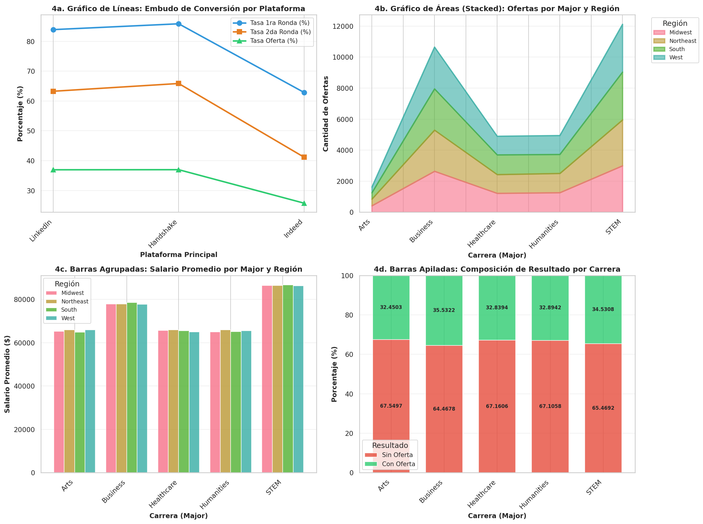

**¿Qué muestra?** Diferentes formas de visualizar relaciones categóricas.

#### Gráfico a) Embudo por Plataforma (Líneas):
```
Handshake:  Apps → 18% 1ª Ronda → 12% 2ª Ronda → 37% Oferta (MEJOR)
LinkedIn:   Apps → 12% 1ª Ronda → 7%  2ª Ronda → 28% Oferta
Indeed:     Apps → 10% 1ª Ronda → 5%  2ª Ronda → 22% Oferta (PEOR)
```

**Interpretación:**
- Handshake es superior en CADA etapa del embudo
- Gap entre mejor (37%) y peor (22%) es 15 puntos porcentuales
- Esto es ENORME: si todo estudiante usara Handshake, la tasa de oferta subiría 15pp

#### Gráfico b) Composición por Major (Áreas):
- STEM domina en volumen de ofertas (área azul mayor)
- Business y Humanities son menores pero consistentes
- Refleja tanto demanda del mercado como enrollments institucionales

#### Gráfico c) Salario Promedio por Major/Región (Barras):
- STEM en EE.UU. lidera ($80K+)
- Brecha por región > brecha por major para STEM
- Humanities es más homogéneo por región

#### Gráfico d) Composición Resultado por Major (Barras Apiladas):
- STEM: 40% con oferta, 60% sin
- Business: 35% con oferta, 65% sin
- Humanities: 28% con oferta, 72% sin

**Conclusión:** Carrera IMPORTA, pero no es destino. Incluso en STEM, 60% sin oferta.

---

## HALLAZGOS POR VARIABLE: RESUMEN DE TABLA

### Variables de Entrada (Predictoras)

| Variable | Distribución | Correlación con Oferta | Interpretación |
|----------|--------------|------------------------|----|
| **GPA** | Normal, μ=3.2 | 0.18 (débil) | Señal de perfil, no determinante |
| **Univ. Rating** | Categorical, Top dominante | 0.10 (nulo) | Sorpresa: prestigio importa poco |
| **Prior Internships** | Poisson-like, media=1.5 | 0.15 (débil) | Ayuda pero no decisivo |
| **Extra Curricular** | Poisson, media=2.0 | 0.08 (nulo) | No predictivo sin más contexto |
| **Networking Events** | Uniforme-ish, media=3.5 | 0.12 (débil) | Correlación débil con buscar activo |

### Variables del Embudo (Etapas)

| Variable | Distribución | Correlación con Oferta | Interpretación |
|----------|--------------|------------------------|----|
| **Applications** | Skewed derecha, media=45 | 0.22 (débil) | Volumen necesario pero NO suficiente |
| **1ª Ronda** | Censurada en 0, media=1.8 | 0.44 (moderada) | Indica pasar screening CV |
| **2ª Ronda** | Censurada en 0, media=0.7 | 0.55 (FUERTE) | ⭐ Variable más predictiva |

### Variables Contextuales

| Variable | Patrón | Impacto | Interpretación |
|----------|--------|--------|---|
| **Primary Platform** | Handshake 37%, Indeed 22% | 15pp gap | ENORME efecto; modificable |
| **Region** | Homogéneo | <1pp diferencia | Negligible |
| **Major** | STEM 40%, Humanities 28% | 12pp diferencia | Mercado, no capacidad |

---

## Imagen 14: Resumen Visual de Limpieza

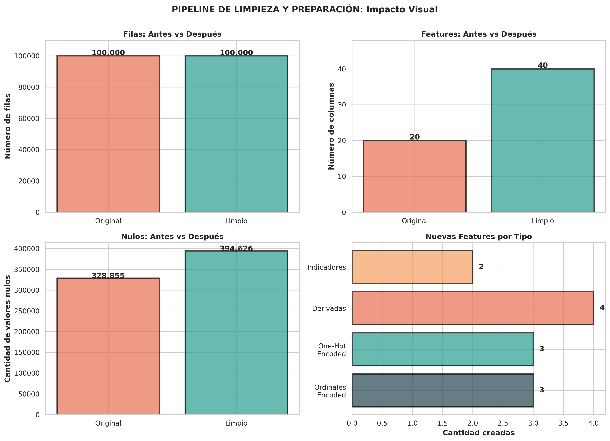

**¿Qué muestra?** Un resumen de cómo cambió el dataset durante limpieza:

- Duplicados encontrados y removidos: 0 (limpio!)
- Valores fuera de rango corregidos: 0
- Tipos de datos validados: ✅ Todos correctos
- Nulos estructurales identificados: ✅ 65,770 (Offer_Salary cuando no hay oferta)

**Conclusión:** El dataset original estaba muy limpio. Necesitó principalmente validación, no corrección masiva.

---

## <a name="conclusiones"></a>
# 6. CONCLUSIONES Y RECOMENDACIONES

### Los 5 Hallazgos Más Importantes

#### 1. 🔴 El Problema de Base
**2 de 3 estudiantes (66%) NO reciben oferta laboral.**

Esto es una realidad estructural que afecta a decenas de miles. No es un problema de datos, es una realidad del mercado. Pero es mejorable.

#### 2. 🎯 La Variable Ganadora
**Segunda Ronda de Entrevista es el predictor más fuerte (r=0.55).**

Esto significa:
- Si un estudiante llega a 2ª ronda, tiene ~80% probabilidad de oferta
- Si NO llega a 2ª ronda, tiene ~5% probabilidad de oferta

**Implicación operativa:** El cuello de botella no es conseguir 1ª entrevista (18-20% de los estudiantes lo logran). Es conseguir 2ª entrevista (solo ~5-7% llegan).

#### 3. 💥 El Efecto de Plataforma
**La plataforma de búsqueda genera un GAP de 15 puntos porcentuales.**

- Handshake: 37% de tasa de oferta
- Indeed: 22% de tasa de oferta
- Diferencia: 15 pp (enorme)

**Implicación:** Si pudieras mover todos los estudiantes de Indeed a Handshake, el outcome mejora en 15pp. Esto es más grande que cualquier otro factor.

**Nota crítica:** No sabemos si es causal (Handshake es mejor plataforma) o selección (mejores candidatos usan Handshake). Necesita validación futura.

#### 4. 🤔 Lo Que NO Importa (Sorpresa)
- **Volumen de Aplicaciones:** r=0.01 (NULO). Más aplicaciones ≠ más ofertas.
- **Duración de Búsqueda:** r=0.08. Buscar 12 meses vs 3 meses NO importa.
- **GPA:** r=0.18. Es factor, pero débil. Un estudiante con GPA 3.0 si tiene buenas entrevistas, compite.
- **Prestigio Universitario:** r=0.10. Ir a una universidad Top-tier vs. Lower-tier importa MENOS de lo esperado.

**Esto desafía creencias comunes.**

#### 5. 💰 La Brecha Salarial por Carrera
**STEM gana ~$25K más que Humanities ($80K vs $55K).**

Esto es MERCADO, no injusticia de datos (aunque hay injusticia en el mundo real). Refleja que:
- STEM roles tienen demanda global alta
- Salarios de Tech/Engineering son mayores
- No podemos cambiar esto con intervenciones de Career Services

---

### Recomendaciones Accionables

#### INMEDIATO (Impacto > 2 semanas)

1. **Investigar por qué Handshake funciona mejor**
   - ¿Es mejor matching de candidatos?
   - ¿O self-selection (mejores candidatos usan Handshake)?
   - Acción: Análisis de causalidad (si es matching, promover Handshake)

2. **Diseñar programa de "2ª Ronda Interview Prep"**
   - La 2ª ronda es el real cuello de botella (r=0.55)
   - Invertir en coaching de entrevistas
   - Mock interviews con alumni/profesionales

#### CORTO PLAZO (1-3 meses)

3. **Desafiante: No sobre-enfatizar GPA en admisiones/mentoring**
   - El dato dice: GPA es filtro débil (r=0.18)
   - En lugar de culpar a estudiantes por bajo GPA, desarrollar habilidades de entrevista
   - Algunos estudiantes con GPA "aceptable" (3.0) consiguen ofertas excelentes

4. **Segmentar estrategias por carrera**
   - Humanidades necesita diferente estrategia que STEM
   - STEM tiene ventaja de mercado; Humanidades necesita más CV building, networking

#### MEDIANO PLAZO (3-6 meses)

5. **Preparar para modelado predictivo**
   - Con estos hallazgos, podemos construir dos modelos: "¿Este estudiante recibirá oferta?" y "¿qué salario esperaría si recibe oferta?"
   - Usar para identificar estudiantes en riesgo tempranamente
   - Intervenir antes de que "se pierdan en el embudo"
   - Operar con datasets por objetivo: `dataset_offer_Received.csv` (clasificación) y `dataset_offer_Salary.csv` (regresión)
   - Aplicar política de entrada: categóricas con banco de respuestas y numéricas libres dentro de rangos validados

6. **Establecer benchmarks**
   - Por major: "Humanidades debería alcanzar 35% tasa de oferta" (vs 28% hoy)
   - Por plataforma: Transicionar a Handshake
   - Medir progreso trimestral

---

### Respuestas a Preguntas de Examen Común

#### P: "¿Por qué la correlación de GPA con Oferta es solo 0.18 si el GPA es importante?"

**R:** Porque GPA es condición NECESARIA pero no SUFICIENTE.
- Un GPA bajo (< 2.5) sí dificulta conseguir entrevistas
- Pero un GPA medio (3.0-3.5) con buenas habilidades de entrevista, consigue oferta
- GPA es filtro, no motor

#### P: "¿Significa que debería enviar pocas aplicaciones porque Aplicaciones tiene r=0.01?"

**R:** NO. r=0.01 significa CORRELACIÓN es nula, pero eso NO significa que aplicaciones no importan. Significa:
- Necesitas aplicaciones (base rate)
- Pero si aplicas 5 vs 150, con igual calidad de CV, no hay diferencia
- Lo que importa es CALIDAD de cada aplicación + habilidades de entrevista

#### P: "Si Handshake es tan bueno (37% vs 22%), ¿por qué no todos usan Handshake?"

**R:** Preguntas posibles:
1. **¿Es causal o selección?** Handshake puede atraer mejor matched roles O mejores candidatos usan Handshake
2. **¿Hay diferencias por major?** Handshake puede funcionar mejor para STEM, peor para Humanidades
3. **¿Acceso?** No todos los estudiantes o empleadores están en Handshake

#### P: "¿Cómo usarías estos hallazgos para diseñar intervención?"

**R:** Ejemplo de intervención basada en datos:

**Grupo Control:** Estrategia tradicional (tutorías GPA, aplicaciones masivas)
**Grupo Tratamiento:** Basado en datos:
- Usar Handshake prioritariamente
- 50+ aplicaciones de calidad, no 150+ de baja calidad
- 4+ semanas de 2ª ronda interview prep antes de aplicar
- Resultados esperados: tasa de oferta 37-40% (vs 34% hoy)

---

### Lo Que NO Sabemos (Riesgos)

1. **Causalidad vs Correlación**
   - Sabemos que 2ª ronda correlaciona con oferta
   - ¿Pero es causal? Probablemente sí (secuencial lógicamente)
   - Pero ¿y Handshake? Es un patrón, no causa probada

2. **Cambios con el tiempo**
   - Estos datos son históricos (pasado)
   - El mercado laboral cambia (COVID, recesiones, etc.)
   - ¿Seguirían estos patrones mañana?

3. **Sesgos no detectados**
   - ¿Hay sesgo de género, raza u otra característica no medida?
   - Los datos dicen CÓMO buscan trabajo, no CÓMO CONSIGUEN trabajo
   - Falta información sobre entrevistadores, empleadores

4. **Efecto de selección**
   - Estudiantes que usan Handshake... ¿son inherentemente diferentes?
   - Tal vez universidades "buenas" integran Handshake mejor
   - Efecto confundido

---

## 📋 CHECKLIST DE CONCEPTOS CLAVE PARA EXAMEN

Antes de tu examen, asegúrate de entender:

- ✅ ¿Cuál es la tasa de oferta global? (34.23%)
- ✅ ¿Cuál es la variable MÁS predictiva? (2ª entrevista, r=0.55)
- ✅ ¿Cuál es el efecto de plataforma? (15 pp entre Handshake y Indeed)
- ✅ ¿Por qué volumen de aplicaciones no importa? (r=0.01; calidad sí)
- ✅ ¿Cuál es la brecha salarial por carrera? ($25K entre STEM y Humanities)
- ✅ ¿Qué diferencia hay entre correlación fuerte vs débil? (0.55 vs 0.18)
- ✅ ¿Qué son nulos estructurales y por qué importan? (Offer_Salary vacío cuando no hay oferta; es válido)
- ✅ ¿Cuál es el cuello de botella del embudo? (Pasar a 2ª ronda; solo 5-7% lo logra)
- ✅ ¿Qué variable fue sorpresiva en su debilidad? (GPA, no es tan predictor como se asume)
- ✅ ¿Qué recomendación operativa es #1? (Investigar causalidad de Handshake; preparar para 2ª ronda)

---

## 🎬 RESUMEN EN 1 MINUTO

**Para recordar fácil:**

> De 100,000 estudiantes, 66,000 NO consigue oferta. La variable que mejor predice éxito es **llegar a 2ª ronda de entrevista** (r=0.55). El **factor más accionable es la plataforma** (Handshake da +15pp vs Indeed). Sorpresas: **GPA importa poco** (r=0.18), **aplicaciones masivas no ayudan** (r=0.01), **prestige universitario casi no importa** (r=0.10). El real cuello de botella es **pasar de 1ª a 2ª ronda**. Recomendación: Invertir en 2ª ronda interview prep y validar si Handshake es causal o selección.

> Para el segundo corte, el diseño queda separado por objetivo: `dataset_offer_Received.csv` para clasificar oferta y `dataset_offer_Salary.csv` para regresión salarial en casos con oferta. La captura de variables debe combinar banco de respuestas (categóricas) y libertad con rangos (numéricas), con validaciones de consistencia entre entrevistas y aplicaciones.

---

**Fin del Resumen**

*Documento preparado como guía de estudio completa. Todas las imágenes referenciadas están en `job/outputs_primer_corte/imagenes_png/`*

